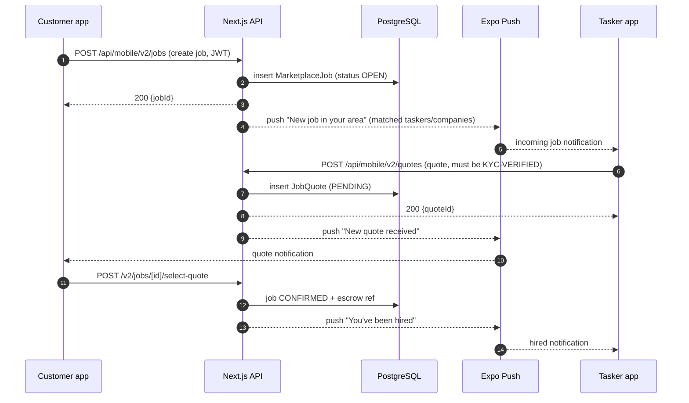
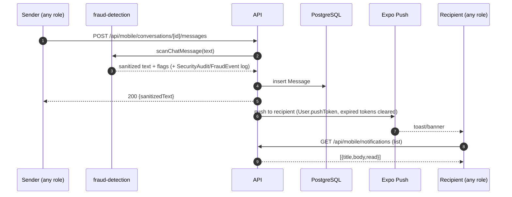

# MaintainEX — Real-Time Tree Diagrams

Visual tree + flow diagrams of how the app actually works **in real time** across the three profiles (**Customer**, **Tasker**, **Company**), the Website/API, the database, and external services.

- **ASCII trees** render anywhere (terminal, any editor).
- **Mermaid diagrams** auto-render on GitHub, VS Code (Markdown Preview), and Typora.

> Realtime note: the app is "near-realtime" — there are **no websockets**. Live updates happen via
> **push notifications** (server→device, instant) + **30-second polling** (device→server) for inbox/unread badges.

---

## 1. System Tree (everything the app touches)

```
MaintainEX (https://maintainex.lk)
│
├─ Mobile App (Expo / React Native)            apps/mobile/
│   ├─ (auth)        welcome · OTP login · register · role-switch
│   ├─ (customer)    HOME · EXPLORE · INBOX · SETTINGS
│   │                jobs/v2 (post/detail/quotes/confirm) · find/taskers · payment · wallet
│   ├─ (tasker)      FIND WORK · MY JOBS · PROFILE
│   │                jobs/v2 (quote/manage) · settings (skills/KYC)
│   ├─ (company)     INDEX · CONTRACTS · MILESTONES · EARNINGS · TEAM · PROFILE
│   │                jobs/v2/browse
│   ├─ (chat)        INBOX (30s poll) · THREAD [id]  ← shared by all 3 roles
│   └─ notifications NOTIFICATION LIST (mark read / mark all)  ← shared by all 3 roles
│
├─ Website / API (Next.js App Router)          maintainex/
│   ├─ app/api/mobile/**        ── mobile JS entry (JWT Bearer auth)
│   │   ├─ v2/jobs · v2/match · v2/quotes · v2/escrow · v2/otp · v2/pricing
│   │   ├─ v2/identity · v2/availability · v2/wallet
│   │   ├─ conversations/**     ── chat (fraud scan + push)
│   │   ├─ notifications/**     ── list / mark read / mark all / register push
│   │   ├─ taskers/** · company/** · upload/** · files/**
│   │   └─ legacy: bookings · template-jobs · find-tasker · quick-bookings · search
│   ├─ app/api/cron/**          ── background jobs
│   │   ├─ matching-waves       ── match taskers/companies to new jobs (wave by wave)
│   │   ├─ escrow-release · offer-timeouts · re-engagement · reputation · pricing-train
│   ├─ app/admin/**  +  app/api/admin/**  ── web admin panel (RBAC, KYC, moderation, settlement)
│   └─ lib/  matching-engine · job-matcher · fraud-detection · mobile-auth · admin-rbac
│
├─ Database (PostgreSQL via Prisma)            prisma/schema.prisma
│   User · TaskerProfile(MXT-) · CompanyProfile(MXC-) · MarketplaceJob · JobQuote
│   JobMatchQueue · OfferMatchQueue · JobEscrow · Conversation · Message · Notification
│   TaskerSkill · ProviderAvailability · IdentityDocument · Contract · Milestone
│   Review · Dispute · OfferProgram · AdminSession
│
└─ External services
    ├─ Expo Push (exp.host)      ── server pushes notifications → devices
    ├─ Cloudflare + Traefik      ── DNS / TLS / routing
    ├─ OTP/SMS phone flow        ── auth
    └─ Docker Swarm + Dokploy    ── hosting
```

---

## 2. Real-Time Architecture (Mermaid)

```mermaid
flowchart TB
    subgraph DEVICES["Mobile App (Expo)"]
        C[CUSTOMER\nhome · explore · inbox · jobs · settings]
        T[TASKER\nfind work · my jobs · profile · jobs v2]
        M[COMPANY\ncontracts · milestones · earnings · team · profile]
        CHAT[(chat) inbox & thread]
        NOTIF[/notifications list/]
    end

    subgraph API["Website / API (Next.js)"]
        AUTH[mobile-auth\nJWT Bearer\nassertNotSuspended]
        JOB[v2/jobs & v2/quotes]
        MATCH[v2/match / matching-wave cron]
        MSG[conversations\nfraud-detection scan]
        NFY[notifications]
        UPL[upload / files]
        CRON[cron jobs\nmatching-waves · escrow-release · offer-timeouts]
    end

    subgraph DB["PostgreSQL (Prisma)"]
        US[User / Profiles]
        JB[MarketplaceJob · JobQuote]
        CN[Conversation · Message]
        NO[Notification]
        ES[JobEscrow · Wallet]
    end

    subgraph EXT["External"]
        PUSH[Expo Push exp.host]
    end

    C -->|POST /v2/jobs| AUTH
    T -->|quote /v2/quotes| AUTH
    M -->|quote /v2/quotes| AUTH
    CHAT -->|GET/POST conversations| AUTH
    NOTIF -->|GET/PUT notifications| AUTH

    AUTH --> JOB --> JB
    AUTH --> MATCH --> JB
    CRON --> MATCH
    AUTH --> MSG --> CN
    MSG -->|push recipient| PUSH --> C & T & M
    AUTH --> NFY --> NO
    NFY -->|push| PUSH
    AUTH --> UPL
    CHAT -->|poll 30s| AUTH
```
*Thick arrows = real-time push. Dashed = 30s polling.*



---

## 3. Messaging in Real Time (all 3 profiles, shared)

```mermaid
flowchart LR
    subgraph Sender
        S1[CUSTOMER\nmsg tasker/company] 
        S2[TASKER\nmsg customer]
        S3[COMPANY\nreply to customer]
    end
    S1 & S2 & S3 -->|POST /conversations/[id]/messages| F[fraud-detection\nwarn & replace]
    F -->|sanitized| DB[(Message)]
    DB -->|push via exp.host| P[Recipient app]
    R[Chat thread 30s poll] -->|GET messages| DB
    I[Inbox / unread badges 30s poll] -->|GET conversations| DB
```



---

## 4. Per-Profile Real-Time Process Trees

### Customer — "I need a plumber"

```
1. LOGIN (OTP, JWT 30d)
2. POST JOB ─────────────► v2/jobs ──► MarketplaceJob OPEN
3. MATCHING               cron matching-waves ──► quotes PUSH to other side; matches listed on job detail
4. MESSAGES provider      NewChatModal ──► Conversation (job-scoped, deduped) ──► push + 30s poll
5. QUOTES                 compare JobQuote PENDING ──► SELECT QUOTE ──► job CONFIRMED + escrow ref
6. WORK IN PROGRESS       OTP verify · workspace · shared address · subtasks
7. COMPLETE + PAY         release escrow / cash payment ──► COMPLETED ──► REVIEW + receipt
                         every step: Notification row + push
```

### Tasker — "I want the job"

```
1. LOGIN → role TASKER → profile setup (skills+experienceLevel, bio, hourlyRate, avatar, phone, area)
2. KYC (IdentityDocument) ──► admin APPROVE ──► quotes allowed (identityStatus==='VERIFIED')
3. FIND WORK (grid)        feed/job-selection ──► open jobs matching my skills/waves
4. SUBMIT QUOTE            v2/quotes (price, time, message) ──► JobQuote PENDING
5. HIRED                   select-quote ──► manage/[id]
6. DELIVER                 message customer (play) · OTP · milestones · workspace
7. EARN                    release-escrow ──► earnings/wallet ──► withdraw
```

### Company — "Thread the quote, run the team"

```
1. LOGIN → role COMPANY → profile (companyName, regNo, taxId, services, logo) + TEAM invites
2. BROWSE JOBS            jobs/v2/browse ──► submit quote (providerType=COMPANY) [KYC-gated]
3. CONTRACT               accepted ──► contracts-list + milestones-list (progress)
4. COMMUNICATE            profile menu: MESSAGES (inbox→thread) · NOTIFICATIONS (list)
5. EARN                   earnings-list ──► escrow/commission settlement (admin)
```

---

## 5. The Real-Time "Loop" (one picture)

```mermaid
flowchart TD
    A[Any profile does an action] -->|JWT call| B[Next.js API]
    B -->|write| C[(PostgreSQL)]
    C -->|cron jobs / matcher wake up| B
    B -->|push exp.host| D[Other user's device]
    D -->|30s poll| E[(chat) inbox + badges / notifications]
    E --> B
    B -->|state back| D
```

**TL;DR** — Every action is a JWT-authenticated call to `api/mobile/**`, writes to PostgreSQL, and wakes up the other side via **Expo Push**; the other side stays in sync with a **30-second poll** on the inbox and unread badges. Matching, escrow release, and offer timeouts are moved by **cron jobs**.