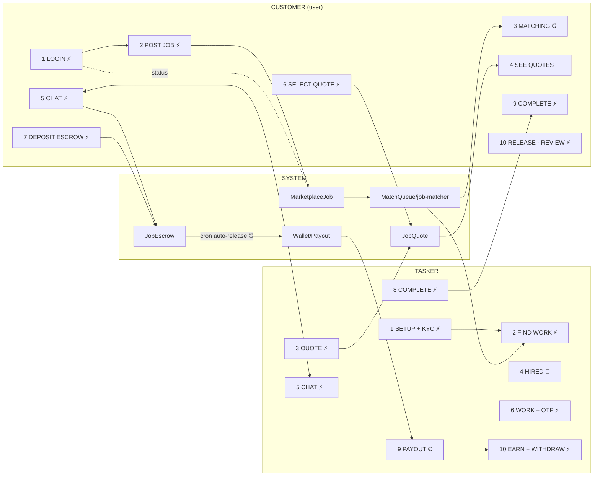

# Booking → Job → Payment Tree (Customer × Tasker, Real-Time)

The complete realtime loop that **is already built**, shown as a tree, plus a clear list of **what we build vs what we need to change**.

**Realtime legend**
- `⚡ JWT call` — instant device→API request
- `🔔 push` — instant server→device (Expo Push, `exp.host`)
- `⏱ poll 30s` — device refreshes from API every 30 seconds (inbox/unread badges)
- `⏰ cron` — background jobs (matching waves, escrow release, offer timeouts)

---

## 1. The Full Loop (both sides at once)

```
 ┌─ CUSTOMER (USER) ─────────────────────────────────┐      ┌─ TASKER ─────────────────────────────────────┐
 │                                                   │      │                                             │
 │ 1. LOGIN ⚡  ─────────► OTP → JWT (30d)           │      │ 1. LOGIN ⚡ → role TASKER                   │
 │                                                   │      │ 2. SETUP ⚡ profile: skills+level, bio,       │
 │ 2. POST A JOB ⚡    POST /v2/jobs                  │      │      hourlyRate, avatar, phone, area        │
 │    → MarketplaceJob OPEN                          │      │ 3. KYC ⚡ IdentityDocument → admin APPROVED   │
 │        │                                          │      │      (quote POST blocked unless VERIFIED)    │
 │        ▼                                          │      │                                             │
 │ 3. MATCHING ⏰  cron matching-waves               │◄─────│ 4. FIND WORK ⚡ job feed / Your Services     │
 │    → JobMatchQueue → taskers & companies          │      │                                             │
 │        │                                          │      │ 5. QUOTE ⚡  POST /v2/quotes (price, time)   │
 │        ▼                                          │      │    → JobQuote PENDING  ────►  🔔 push 🡒     │
 │ 4. RECEIVE QUOTES 🔔 push + ⏱ list               │      │     (customer sees "New quote received")     │
 │    compare quotes on job detail                   │      │                                             │
 │ 5. MESSAGES ⚡ NewChatModal                        │◄────►│ 6. MESSAGES ⚡ reply in thread                │
 │    conversation job-scoped · dedup                │      │    fraud-scan → sanitize → 🔔 push → ⏱ poll  │
 │    🔔 push → ⏱ poll 30s (inbox/badges)           │      │                                             │
 │        ▼                                          │      │                                             │
 │ 6. SELECT QUOTE ⚡ POST /v2/jobs/[id]/select-quote│      │ 7. HIRED 🔔 push "You've been hired"         │
 │    → ACCEPTED chosen · REJECTED rest              │      │    → manage/[id] screen                     │
 │    → job IN_PROGRESS                              │      │                                             │
 │        ▼                                          │      │                                             │
 │ 7. DEPOSIT ESCROW ⚡ POST escrow (job IN_PROGRESS)│      │ 8. START WORK ⚡ workspace · OTP verify       │
 │    pulls from wallet balance                      │      │    shared address · subtasks · location      │
 │    → JobEscrow created                            │      │                                             │
 │        │                                          │      │                                             │
 │ 8. TRACK / CHAT ⏱·🔔  updates on both sides       │◄────►│ 9. MESSAGES customer + status updates ⚡     │
 │        ▼                                          │      │                                             │
 │ 9. COMPLETE ⚡ POST /v2/jobs/[id]/complete         │◄─────│ 10. MARK COMPLETE ⚡ (or OTP-confirm)        │
 │    → status COMPLETED                             │      │                                             │
 │        ▼                                          │      │                                             │
 │ 10. RELEASE / REVIEW ⚡ release-escrow + cash/card │      │ 11. PAYOUT ⏰ escrow-release cron (auto      │
 │     · optional cash-payment                       │      │     after 48h w/ reminders) OR manual        │
 │     · review + rating                             │      │  12. EARN ⚡ wallet +balance → withdraw     │
 │        └────────►  🔔 push every step ⟶           │      │      → Payout PENDING (admin processes)      │
 └───────────────────────────────────────────────────┘      └─────────────────────────────────────────────┘
```

---

## 2. Mermaid — one picture, both roles



---

## 3. Real-Time Mechanics (when the "real" happens)

| Step | In real time it looks like… | Mechanism |
|---|---|---|
| New job posted | matcher wakes in next cron wave; quotes/push start | `⏰ cron matching-waves` |
| Provider quotes / customer picks | other side gets a phone banner instantly | `🔔 push` |
| Chat message | recipient notified instantly; list updates in ≤30s | `🔔 push` + `⏱ poll 30s` |
| Customer deposits escrow | wallet decremented; escrow row created | `⚡ JWT` + wallet |
| Work complete both sides | status flips; reminders fire before auto-release | `⚡ JWT` + `⏰ cron` |
| Payment released | tasker wallet += amount; notifications pushed | `⏰ cron` / settings |
| Tasker withdraws | Payout PENDING row for admin to fill | `⚡ JWT` + admin manual |

---

## 4. What We BUILT (already works end-to-end)

- ✅ Account + role system (OTP login, JWT 30d, role-switch, on-boarding per role)
- ✅ Customer **posts job** → categories, budget, urgency, area, subtasks (`v2/jobs`)
- ✅ **Matching** engine + cron waves → taskers & companies get the job (w/ availability, verification)
- ✅ Tasker **KYC/id check** (quotes blocked unless `identityStatus === 'VERIFIED'`)
- ✅ **Quotes** (`JobQuote`: INDIVIDUAL/COMPANY, price, ETA, message) + customer **select-quote** (accept/reject)
- ✅ **Messaging** all roles: job-scoped conversations, dedup, fraud warn-and-replace anti-cheat, rate limit, read tracking, unread badges
- ✅ **Notifications**: in-app list (`/notifications`, mark read/all) + push tokens + server push
- ✅ **Escrow** deposit from **wallet balance**, auto-release cron (48h default) + reminder notifications
- ✅ **OTP confirm** at start, **workspace**, shared address, subtasks, optional **cash payment**
- ✅ **Completion + review/rating + receipt**
- ✅ Tasker **earnings/wallet** + **withdraw** (Payout request)
- ✅ Admin panel: KYC review, moderation, escrow/commission settlement, work-queue alerts

## 5. What We NEED TO CHANGE (honest gaps)

| # | Gap | Why it matters | Priority |
|---|---|---|---|
| 1 | **No real payment gateway** — wallet top-up just adds balance in DB; PayHere listed in UI but no gateway/webhook wired | Customers can't actually pay with card/bank/eZ Cash; money is virtual | 🔴 HIGH |
| 2 | **Tasker payout is manual** — WITHDRAW creates `Payout PENDING` for admin; no automated bank transfer | Taskers wait; trust/earning experience is fake | 🔴 HIGH |
| 3 | **Escrow deposit only starts when job is `IN_PROGRESS`** — nothing held while job is OPEN | No commitment/trust guard before work begins | 🟡 MED |
| 4 | **No websockets** — inbox/badges use 30s polling; push covers events | Fine for MVP, but not "instant presence"; upgrade optional (Supabase/socket) | 🟡 MED |
| 5 | **No live job/location map** — tasker share-address + status exist, but no live tracking feed customer-side | Booking→wallet→tracking promise partial | 🟢 LOW |
| 6 | **Company mobile flow thinner** — contracts/milestones/team exist; no company manage/quote-detail screens, and company→customer message has no button (legacy `Contract` has no customer user id) | Company experience incomplete vs tasker | 🟡 MED |
| 7 | **Test/UX plumbing** — notifications settings screen is a generic list (translate strings for inbox/timezones), mobile requires dev build for full foreground push | polish | 🟢 LOW |

> Recommendation: #1 + #2 (real money in/out) are what "payment" means to a user — do those first. #3/#4 complete the realtime trust loop. #5–#7 are progressive enhancement.

---
*Cross-ref: `docs/APP-STRUCTURE.md` (models/APIs per profile) · `docs/APP-TREE.md` (realtime architecture) · live build: `8601d12` pushed.