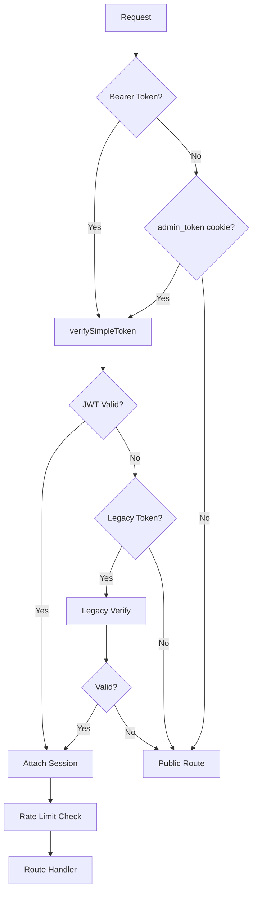

# Authentication Architecture

Auth systems, JWT management, OTP flow, session handling, and RBAC.

---

## Overview

MaintainEX has three co-existing authentication systems:

1. **Marketplace JWT** — For mobile app users (customers, providers, companies)
2. **Staff JWT** — For admin panel staff with role-based access
3. **Legacy Admin Token** — HMAC-based cookie token (being phased out)

All systems share the same secret derivation but use separate audiences and lifetimes.

---

## Auth System Comparison

| Property | Marketplace JWT | Staff JWT | Legacy Token |
|---|---|---|---|
| Secret | `MARKETPLACE_JWT_SECRET` | `STAFF_JWT_SECRET` | `JWT_SECRET` / `NEXTAUTH_SECRET` |
| Audience | `maintainex-marketplace` | `maintainex-staff` | N/A |
| Access TTL | 15 minutes | 30 minutes | 30 days |
| Refresh TTL | 30 days | 7 days | N/A |
| Storage | Device secure storage | HttpOnly cookie | `admin_token` cookie |
| 2FA | No | Optional (TOTP) | No |
| Session table | `UserSession` | `AdminSession` | No |
| User model | `User` | `Admin` | `Admin` |

---

## Marketplace JWT

### Token Structure

Defined in `lib/auth/marketplace-jwt.ts:19-28`:

```typescript
interface MarketplaceAccessTokenClaims {
  sub: string      // User ID (cuid)
  sid: string      // Session ID
  aud: string      // "maintainex-marketplace"
  iss: string      // "maintainex"
  jti: string      // Unique token ID (randomUUID)
  type: string     // "marketplace_access"
  iat: number      // Issued at (Unix timestamp)
  exp: number      // Expires at (Unix timestamp)
}
```

### Signing

Uses `jsonwebtoken` library with HMAC-SHA256. TTL parsed from `TOKEN_LIFETIMES.MARKETPLACE_ACCESS` (`lib/auth/constants.ts:16`).

### Refresh Flow

1. Client sends expired access token + refresh token
2. Server validates refresh token hash against `UserSession`
3. New access token issued, old refresh token rotated
4. `tokenFamilyId` tracks refresh chain for revoke-all capability

---

## Staff JWT

### Token Structure

Defined in `lib/auth/staff-jwt.ts:9-18`:

```typescript
interface StaffAccessTokenClaims {
  sub: string      // Admin user ID
  sid: string      // Session ID (AdminSession.id)
  aud: string      // "maintainex-staff"
  iss: string      // "maintainex"
  jti: string      // Unique token ID
  type: string     // "staff_access"
  iat: number
  exp: number
}
```

### 2FA (TOTP)

Optional per admin role. Flow:

1. Admin logs in with email + password
2. If 2FA enabled: return `requires_2fa` with temp token (5-minute TTL)
3. Admin submits TOTP code
4. Server verifies against stored secret
5. Full access token issued

### Session Revocation

`AdminSession` table tracks active sessions. Revocation sets `revokedAt` and `revokeReason`. Middleware checks revocation on every request.

---

## OTP Flow (Phone-Based Auth)

### Send OTP

```
POST /api/mobile/auth/send-otp
Body: { phone: "+94771234567" }
```

Rate limits:
- 3 OTPs per phone number per hour
- 5 OTPs per IP per hour
- 60 seconds between sends per phone

### Verify OTP

```
POST /api/mobile/auth/verify-otp
Body: { phone: "+94771234567", code: "123456" }
```

- 5 wrong attempts = account locked, must request new code
- OTP hash stored in `OTP` table with `codeHash`, `attempts`, `isUsed`
- On success: generate JWT pair, create `UserSession`

### Phone Number Format

All phone numbers stored in E.164 international format:
- Sri Lanka: `+94771234567`
- Canada: `+14161234567`

Country picker supports LK (+94) and CA (+1) dial codes.

---

## Middleware Auth Chain

Defined in `middleware.ts:116-150`:



### Token Verification

`verifySimpleToken()` (`middleware.ts:82-114`):

1. Split token into parts
2. If 3 parts (JWT): verify HMAC-SHA256 signature via Web Crypto API
3. Decode payload, check `exp` claim
4. If 2 parts (legacy): HMAC comparison with `JWT_SECRET`
5. Check 30-day max age for legacy tokens

---

## RBAC (Role-Based Access Control)

### Admin Roles

Six roles defined in `lib/admin-types.ts:1`:

| Role | Permissions Count | Key Capabilities |
|---|---|---|
| `SUPER_ADMIN` | 36 | All permissions, reassign work queue |
| `MANAGER` | 26 | Full read, resolve escalations, manage queue |
| `FINANCE` | 14 | Commission, wallets, settlements, pricing config |
| `USER_MANAGEMENT` | 17 | KYC, suspension, bans, professions |
| `SUPPORT` | 12 | Disputes, complaints, user tickets |
| `TECHNICAL` | 5 | Security audit, system health |

### Permission Pattern

Permissions follow `resource:action` naming:
```
users:view, users:edit, users:ban, users:suspend
kyc:view, kyc:approve, kyc:reject
jobs:view, jobs:manage, jobs:cancel
commission:view, commission:manage, commission:config
```

### Enforcement

Admin API routes check permissions via `getAdminSession()` which:
1. Validates JWT signature and expiry
2. Looks up `AdminSession` in database (checks revocation)
3. Loads `Admin` record with role
4. Checks role against required permission for the route

---

## Suspension Enforcement

`assertNotSuspended()` blocks all write operations for suspended/banned users.

Applied to 41+ write routes in `app/api/mobile/`. Returns 403 with:
- `SUSPENDED` — User is temporarily suspended
- `BANNED` — User is permanently banned (off-platform deals)

Login also blocks suspended/banned users.

---

## Password Hashing

- Algorithm: bcryptjs with 14 rounds
- Pepper: SHA-256 hash of password before bcrypt
- Stored in `User.passwordHash` and `Admin.password`

---

## Security Properties

| Property | Implementation |
|---|---|
| Token signing | HMAC-SHA256 via Web Crypto API |
| Refresh token rotation | New refresh token on each use, family tracking |
| Session revocation | `AdminSession.revokedAt` checked on every request |
| OTP lockout | 5 wrong attempts = lock, new code required |
| Rate limiting | Per-IP and per-account (cross-IP aggregation) |
| Credential stuffing detection | 5+ unique emails/IP triggers IP block |
| Bot detection | Interval variance analysis on login patterns |

---

## References

- Constants: `lib/auth/constants.ts`
- Marketplace JWT: `lib/auth/marketplace-jwt.ts`
- Staff JWT: `lib/auth/staff-jwt.ts`
- Middleware: `middleware.ts`
- Mobile auth helper: `lib/mobile-auth.ts`
- Admin RBAC: `lib/admin-rbac.ts`
- Security: [security-layers.md](./security-layers.md)
