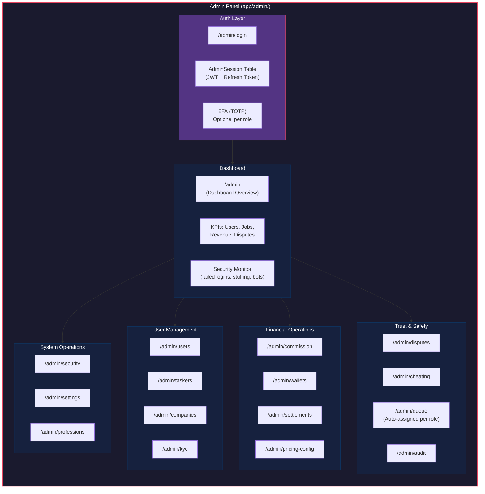
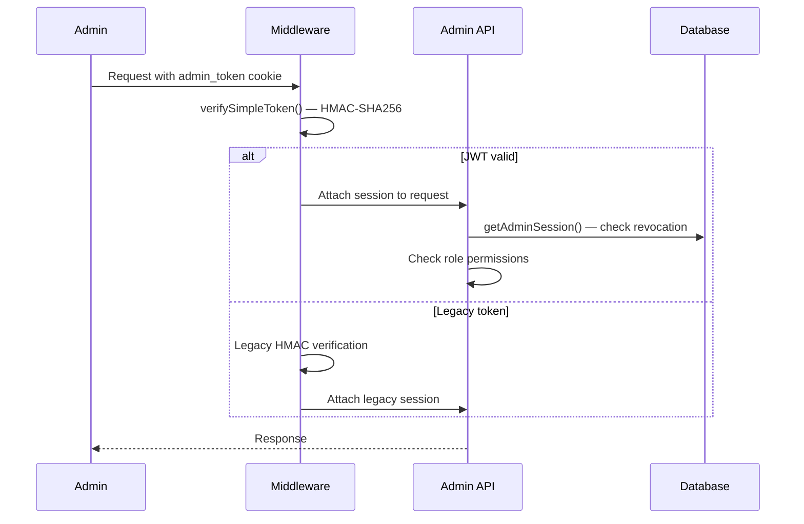

# Admin Panel Component Structure

C4 Level 3 — Admin panel internal architecture, RBAC, and work queues.

---

## Overview

The admin panel is a Next.js App Router application served under `/admin/`. It implements a 6-role RBAC system with granular permissions, audit logging, and role-based work queues.

---

## Admin Roles

Defined in `lib/admin-types.ts:1-10`:

| Role | Description | Queue |
|---|---|---|
| `SUPER_ADMIN` | Full platform access, can reassign work | All queues |
| `MANAGER` | Full read, reassign work, resolve escalations | Dispute queue |
| `FINANCE` | Commission, wallets, settlements | Settlement queue |
| `USER_MANAGEMENT` | KYC review, suspension, bans | KYC queue |
| `SUPPORT` | Disputes, complaints, user tickets | Dispute queue |
| `TECHNICAL` | Security audit, system health, error logs | System queue |

---

## Permission Matrix

Defined in `lib/admin-types.ts:12-100`. Permissions follow the `resource:action` pattern:

```
dashboard:view
users:view, users:edit, users:ban, users:suspend
taskers:view, taskers:edit, taskers:ban, taskers:verify
companies:view, companies:edit, companies:ban, companies:verify
kyc:view, kyc:approve, kyc:reject
jobs:view, jobs:manage, jobs:cancel
commission:view, commission:manage, commission:config
wallets:view, wallets:manage
disputes:view, disputes:resolve
queue:view, queue:manage, queue:assign
security:view, security:audit
settings:view, settings:edit
```

Each role has a defined permission set. `SUPER_ADMIN` has all permissions. Other roles are restricted to their domain.

---

## Component Architecture



---

## Auth Layer

### Session Management

Admin sessions use JWT access + refresh tokens stored in the `AdminSession` table.

| Token | TTL | Storage |
|---|---|---|
| Access token | 30 minutes | Cookie (`admin_token`) + memory |
| Refresh token | 7 days | HttpOnly cookie |
| 2FA temp token | 5 minutes | Server-side only |

Token signing uses `STAFF_JWT_SECRET` (see `lib/auth/staff-jwt.ts:3-7`). Audience: `maintainex-staff`, issuer: `maintainex`.

### Auth Flow



---

## Work Queue System

Auto-assigned alerts via `AdminAlert` model. Round-robin assignment within roles.

| Alert Type | Assigned To | Auto-Trigger |
|---|---|---|
| KYC Submission | `USER_MANAGEMENT` | User submits identity docs |
| Dispute Created | `SUPPORT` | Customer or provider opens dispute |
| Settlement Overdue | `FINANCE` | Escrow not settled within SLA |
| Job Flagged | `MANAGER` | Content or behavior flagged |

### Queue Properties

- `assignedRole` — Target role for the alert
- `priority` — Urgency level
- `notes` — Admin annotations
- Manager/Super Admin can reassign across roles

---

## API Routes (Admin)

Protected by staff JWT. All routes in `app/api/admin/`:

| Route | Permission | Purpose |
|---|---|---|
| `GET /api/admin/users` | `users:view` | List users with filters |
| `PATCH /api/admin/users/[id]` | `users:edit` | Edit user profile |
| `POST /api/admin/users/[id]/ban` | `users:ban` | Ban user |
| `POST /api/admin/users/[id]/suspend` | `users:suspend` | Suspend user |
| `GET /api/admin/taskers` | `taskers:view` | List taskers |
| `POST /api/admin/taskers/[id]/verify` | `taskers:verify` | Verify tasker identity |
| `GET /api/admin/kyc` | `kyc:view` | KYC review queue |
| `POST /api/admin/kyc/[id]/approve` | `kyc:approve` | Approve KYC |
| `PATCH /api/admin/jobs/[id]` | `jobs:manage` | Cancel/flag/refund jobs |
| `GET /api/admin/disputes` | `disputes:view` | Dispute queue |
| `POST /api/admin/disputes/[id]/resolve` | `disputes:resolve` | Resolve dispute |
| `GET /api/admin/security/failed-logins` | `security:audit` | Security monitoring |
| `GET /api/admin/audit` | `audit:read` | Audit log |

---

## Audit Logging

All admin write actions are logged with:

- Actor identity (admin user ID, email, role)
- Action performed
- Target entity (user, job, dispute)
- Timestamp
- IP address

Stored in the `AuditLog` model. Queryable via `/api/admin/audit`.

---

## References

- RBAC permissions: `lib/admin-types.ts:12-100`
- Staff JWT: `lib/auth/staff-jwt.ts`
- Admin RBAC helper: `lib/admin-rbac.ts`
- System context: [system-context.md](./system-context.md)
- Security: [security-layers.md](./security-layers.md)
