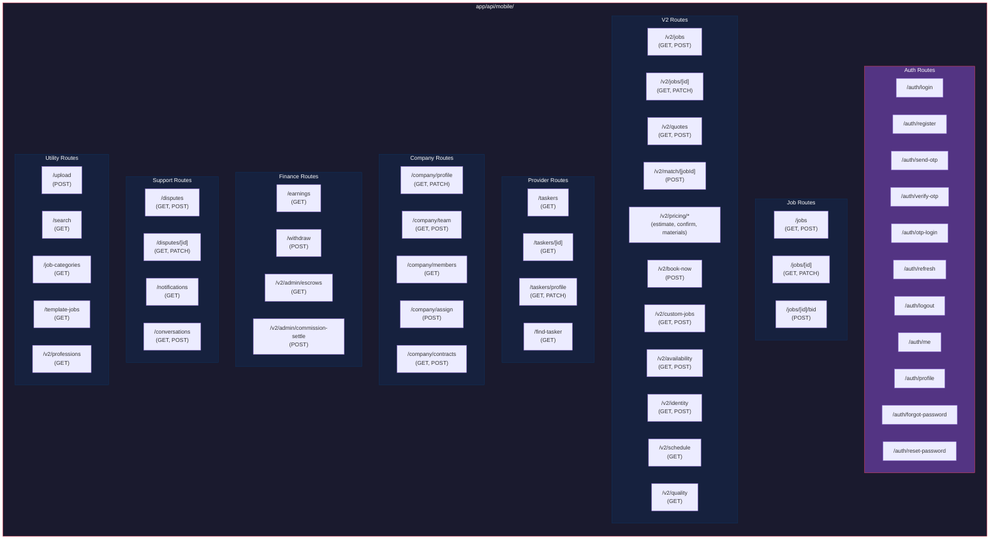
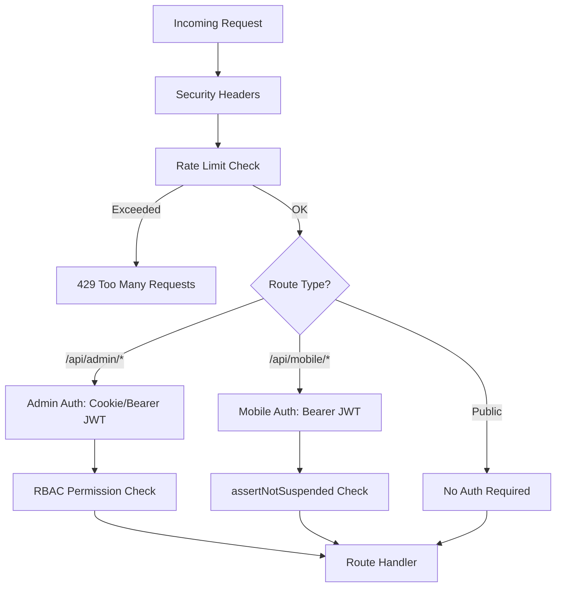
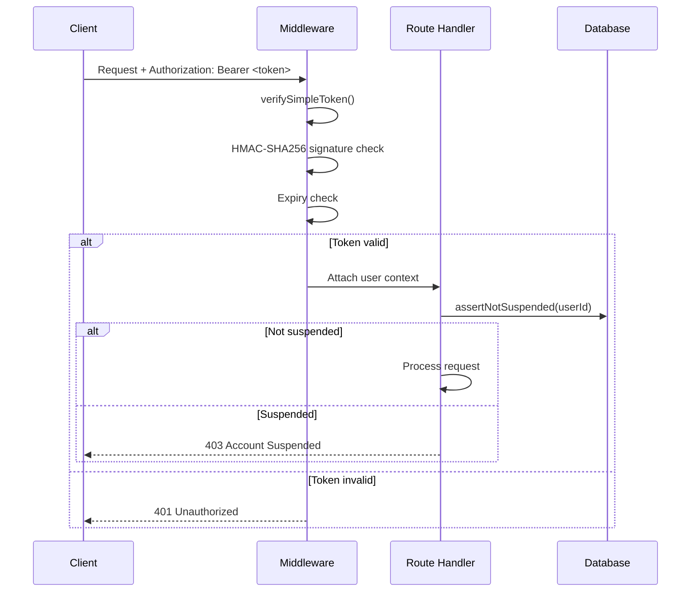

# Marketplace API Routes Structure

C4 Level 3 — API routes, middleware chain, and auth flow for the marketplace API.

---

## Overview

The marketplace API is served by Next.js App Router route handlers under `app/api/mobile/`. Two versions coexist: v1 (legacy) and v2 (current). All routes use REST conventions with JSON payloads.

---

## Route Map



---

## Middleware Chain

Every request passes through the global middleware defined in `middleware.ts`.



### Security Headers

Applied to all responses (`middleware.ts:12-22`):

```
X-DNS-Prefetch-Control: on
X-Frame-Options: SAMEORIGIN
X-Content-Type-Options: nosniff
X-XSS-Protection: 1; mode=block
Referrer-Policy: strict-origin-when-cross-origin
Permissions-Policy: camera=(), microphone=(), geolocation=()
Cross-Origin-Opener-Policy: same-origin
Cross-Origin-Resource-Policy: same-origin
Strict-Transport-Security: max-age=31536000; includeSubDomains
```

### Rate Limits

Defined in `middleware.ts:32-36`:

| Category | Max Requests | Window |
|---|---|---|
| Default | 100 | 60 seconds |
| Auth (`/auth/*`) | 5 | 60 seconds |
| Admin | 200 | 60 seconds |

---

## Auth Flow (Mobile)

### Token Verification



### JWT Claims (Marketplace)

Defined in `lib/auth/marketplace-jwt.ts:19-28`:

```typescript
interface MarketplaceAccessTokenClaims {
  sub: string      // User ID
  sid: string      // Session ID
  aud: string      // "maintainex-marketplace"
  iss: string      // "maintainex"
  jti: string      // Unique token ID
  type: string     // "marketplace_access"
  iat: number      // Issued at
  exp: number      // Expires at
}
```

Token lifetime: 15 minutes (access), 30 days (refresh).

---

## Suspension Enforcement

`assertNotSuspended()` is called on all write routes (41+ routes). Blocks:

- `isSuspended === true` — Returns 403 with suspension reason
- `isBanned === true` — Returns 403 with ban reason
- Login blocked for suspended/banned users

---

## IDOR Protection

The `GET /api/mobile/v2/jobs/[id]` endpoint includes ownership verification:

1. Fetch job with ownership fields
2. Verify requesting user is the customer, provider, or company member
3. Redact sensitive fields (internal notes, admin flags) for non-admin users

---

## Request/Response Conventions

| Convention | Pattern |
|---|---|
| Pagination | `?page=1&limit=20` |
| Filtering | `?status=OPEN&category=...` |
| Sorting | `?sort=createdAt&order=desc` |
| Error format | `{ error: string, code?: string }` |
| Success format | `{ data: T }` or `{ data: T[], meta: { total, page, limit } }` |

---

## Route Count Summary

| Group | Routes | Notes |
|---|---|---|
| Auth | 11 | Login, register, OTP, profile |
| Jobs (v1) | 3 | Legacy, being migrated to v2 |
| Jobs (v2) | 8 | Current, full lifecycle |
| Providers | 5 | Search, profile, eligibility |
| Companies | 12 | Profile, team, contracts, assignments |
| Finance | 4 | Earnings, withdrawals, settlement |
| Support | 5 | Disputes, notifications, messaging |
| Utility | 8 | Upload, search, categories, templates |
| **Total** | **56+** | v1 + v2 coexistence |

---

## References

- Mobile auth: `lib/auth/marketplace-jwt.ts`
- Auth constants: `lib/auth/constants.ts`
- Middleware: `middleware.ts`
- Security: [security-layers.md](./security-layers.md)
- Authentication: [authentication.md](./authentication.md)
