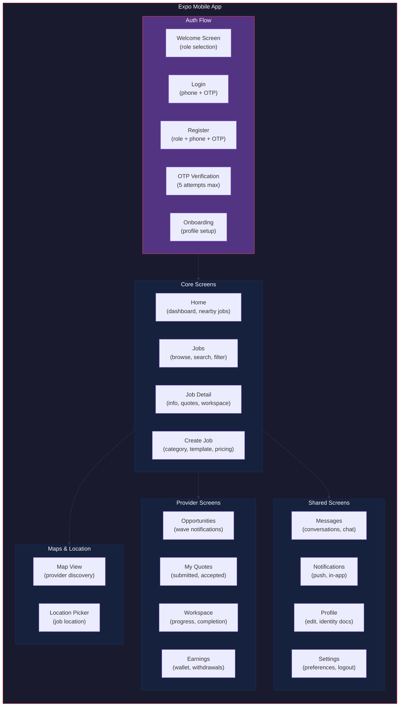
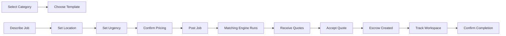
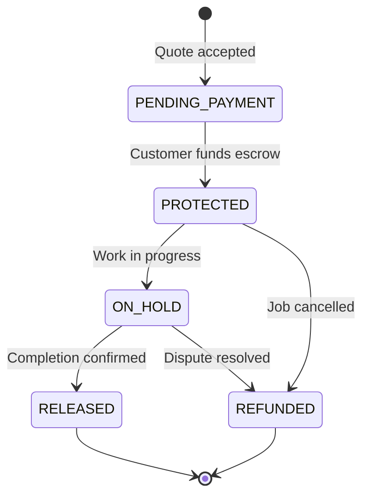

# Mobile App Component Structure

C4 Level 3 — Expo mobile app internal architecture.

---

## Overview

The mobile app is an Expo React Native application located in `apps/mobile/`. It communicates with the MaintainEX backend via REST API using JWT Bearer authentication (18-day TTL).

---

## App Architecture

---

## Auth Module

### OTP-Based Flow

Phone number is the primary identifier. Email is optional fallback.

| Step | Endpoint | Description |
|---|---|---|
| 1. Send OTP | `POST /auth/send-otp` | Rate limited: 3/phone/hr, 5/IP/hr, 60s cooldown |
| 2. Verify OTP | `POST /auth/verify-otp` | 5 wrong attempts = lock, must request new code |
| 3. Get Token | Response | JWT access (18d) + refresh token |
| 4. Register | `POST /auth/register` | Role selection -> OTP -> onboarding |

### Token Management

- Access token stored in device secure storage
- Refreshed on app open (updates `lastActiveAt`)
- Sent as `Authorization: Bearer <token>` header

### Provider Registration States

Provider accounts go through approval:

1. Register with role `PROVIDER`
2. Complete profile (name, phone, location)
3. Submit identity documents
4. `identityStatus: NOT_SUBMITTED` -> `PENDING` -> `VERIFIED`
5. Cannot receive job matches until `VERIFIED`

---

## Jobs Module

### Customer Flow

### Provider Flow

```mermaid
graph LR
    A[Receive Wave Notification] --> B[View Job Details]
    B --> C[Accept Opportunity]
    C --> D[Submit Quote]
    D --> E[Quote Accepted]
    E --> F[Workspace Created]
    F --> G[Start Work]
    G --> H[Request Completion]
    H --> I[Customer Confirms]
    I --> J[Escrow Released]
    J --> K[Earnings Updated]
```

### API Endpoints (Mobile v2)

| Endpoint | Method | Purpose |
|---|---|---|
| `/v2/jobs` | GET/POST | List/create jobs |
| `/v2/jobs/[id]` | GET/PATCH | Job detail, update status |
| `/v2/jobs/[id]/otp` | POST | Verification PIN for completion |
| `/v2/jobs/[id]/evidence` | POST | Upload completion evidence |
| `/v2/quotes` | GET/POST | List/submit quotes |
| `/v2/match/[jobId]` | POST | Trigger matching for job |
| `/v2/book-now` | POST | Instant booking |
| `/v2/custom-jobs` | POST | Custom job request |

---

## Matching Module

### Opportunity Notifications

When the matching engine runs, providers receive wave notifications:

1. **Wave 1**: Top 3 providers, 15-minute expiry
2. **Wave 2**: Top 5 providers, 15-minute expiry
3. **Wave 3**: Top 8 providers, 30-minute expiry

Provider can:
- View job details
- Accept opportunity (becomes quote eligible)
- Decline opportunity
- Let it expire (moves to next wave)

### Provider Eligibility Checks

Before a provider is included in matching:

1. Account exists, active, not suspended/banned
2. Identity verified (`identityStatus === 'VERIFIED'`)
3. Provider profile verified
4. Has approved profession for the service
5. Jurisdiction credentials (if required)
6. Service area matches job country
7. No active job conflicts
8. Quality floor met (rating >= 3.0)

---

## Payments Module

### Escrow Lifecycle

### Wallet & Withdrawals

- Provider wallet credited on escrow release
- Withdrawal via `POST /withdraw`
- Cash-to-agent commission tracked separately
- Settlement tracked per provider

---

## Messaging Module

- Real-time conversations between customer and provider
- Conversation per job (1:1)
- Message history persisted in `Message` table
- Push notifications for new messages

---

## Maps Integration

- Apple Maps (iOS default) and Google Maps (Android)
- Provider location stored as lat/lng
- Job location geocoded on creation
- Distance-based scoring in matching engine (`lib/matching/scoring.ts:77-90`)

---

## Push Notifications

Registered on app open via `expo-notifications`:

- Push token saved to `User.pushToken`
- Notifications for: job matches, quote updates, workspace changes, messages
- In-app notification center with unread count

---

## Internationalization

- Three locales: English (`en`), Sinhala (`si`), Tamil (`ta`)
- Configured via `react-i18next`
- RTL support for Sinhala/Tamil layouts
- Parity tests verify all keys exist across locales

See [localization.md](./localization.md) for details.

---

## References

- Mobile API routes: `app/api/mobile/`
- Mobile app source: `apps/mobile/`
- Auth constants: `lib/auth/constants.ts`
- Matching engine: [matching-engine.md](./matching-engine.md)
- Pricing engine: [pricing-engine.md](./pricing-engine.md)
