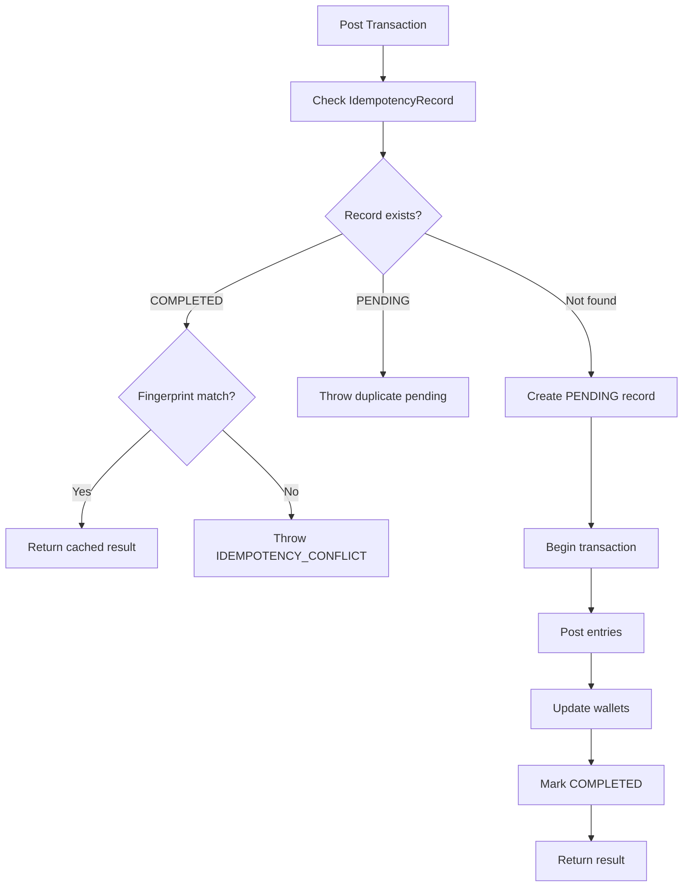

# Concurrency Patterns

Optimistic locking, SELECT FOR UPDATE, idempotency, and compare-and-swap patterns.

---

## Overview

MaintainEX handles concurrent access without distributed locks. The system uses optimistic concurrency control, idempotency keys, and atomic database operations to prevent race conditions and duplicate processing.

---

## Patterns Summary

| Pattern | Where Used | Mechanism |
|---|---|---|
| Optimistic Locking | Job state transitions | `updateMany` with status guard |
| Atomic Update | Opportunity responses | Single-record status check + update |
| Idempotency Keys | Ledger transactions | Unique constraint on `IdempotencyRecord` |
| Batch Atomicity | Quote acceptance | `$transaction` with multiple claims |
| Payload Fingerprinting | Ledger conflict detection | SHA-256 hash of normalized entries |

---

## Pattern 1: Optimistic Locking

### Job Status Transition

Defined in `lib/domain/job-lifecycle.ts:85-89`:

```typescript
const changed = await prisma.marketplaceJob.updateMany({
  where: { id: ctx.jobId, status: job.status },  // WHERE matches current state
  data: { status: targetStatus },
})
if (changed.count !== 1) throw new Error('Job state changed concurrently')
```

**How it works:**

1. Read current status
2. Attempt update with WHERE clause matching current status
3. If `changed.count === 1`: success
4. If `changed.count === 0`: another request modified the status first

**Why `updateMany` instead of `update`:**

- `update` requires `id` as unique key but doesn't support compound WHERE
- `updateMany` supports arbitrary WHERE clauses including status guards
- Returns count of affected rows for verification

### Workspace Status Transition

Same pattern used in `lib/domain/job-lifecycle.ts:112-119`:

```typescript
const changed = await prisma.jobWorkspace.updateMany({
  where: { jobId: ctx.jobId, progressStatus: workspace.progressStatus },
  data: { progressStatus: targetStatus },
})
if (changed.count !== 1) throw new Error('Workspace state changed concurrently')
```

---

## Pattern 2: Atomic Opportunity Response

Defined in `lib/matching/waves.ts:157-188`:

```typescript
const opportunity = await client.providerOpportunity.findFirst({
  where: { jobId, taskerId: providerId },
})

if (opportunity.status === 'EXPIRED') return { success: false, error: 'Opportunity expired' }
if (opportunity.status === 'ACCEPTED' || opportunity.status === 'DECLINED') {
  return { success: false, error: 'Already responded' }
}

await client.providerOpportunity.update({
  where: { id: opportunity.id },
  data: {
    status: response,
    response,
    respondedAt: new Date(),
  },
})
```

**Race condition window:**

Between `findFirst` and `update`, another request could modify the opportunity. However, since:
- Providers can only respond to their own opportunities
- The UI disables the button after first tap
- Database unique constraints prevent duplicates

The window is practically safe. For stronger guarantees, a `SELECT ... FOR UPDATE` pattern could be added.

---

## Pattern 3: Idempotency Keys (Ledger)

Defined in `lib/ledger.ts:112-150`:

### Flow



### Fingerprint Detection

Defined in `lib/ledger.ts:45-50`:

```typescript
function computePayloadFingerprint(entries: LedgerEntry[], currency: Currency): string {
  const normalized = entries
    .map(e => `${e.accountId}:${e.accountType}:${e.entryType}:${e.amount.toString()}`)
    .sort()
    .join('|')
  return createHash('sha256').update(`${currency}:${normalized}`).digest('hex')
}
```

If same `idempotencyKey` is reused with different amounts/accounts, the fingerprint mismatch triggers `IDEMPOTENCY_CONFLICT`.

---

## Pattern 4: Batch Atomicity (Quote Acceptance)

Defined in `lib/domain/job-lifecycle.ts:162-199`:

```typescript
await prisma.$transaction(async (tx) => {
  // Claim 1: Job status OPEN -> QUOTE_ACCEPTED
  const jobClaim = await tx.marketplaceJob.updateMany({
    where: { id: ctx.jobId, status: 'OPEN' },
    data: { status: 'QUOTE_ACCEPTED' },
  })
  if (jobClaim.count !== 1) throw new Error('Job already has an accepted quote')

  // Claim 2: Quote status PENDING -> ACCEPTED
  const quoteClaim = await tx.jobQuote.updateMany({
    where: { id: quoteId, jobId: ctx.jobId, status: 'PENDING' },
    data: { status: 'ACCEPTED' },
  })
  if (quoteClaim.count !== 1) throw new Error('Quote is no longer available')

  // Reject all other pending quotes
  await tx.jobQuote.updateMany({
    where: { jobId: ctx.jobId, id: { not: quoteId }, status: 'PENDING' },
    data: { status: 'REJECTED' },
  })

  // Create workspace
  await tx.jobWorkspace.upsert({ ... })

  // Create/update escrow
  await tx.jobEscrow.upsert({ ... })
})
```

**Atomicity guarantee:** All operations succeed or all fail. If any `updateMany` returns count 0, the entire transaction rolls back.

---

## Pattern 5: Concurrent Wave Idempotency

Defined in `lib/matching/waves.ts:36-44`:

```typescript
const existing = await client.providerOpportunity.findFirst({
  where: {
    jobId,
    ...(candidate.providerType === 'INDIVIDUAL'
      ? { taskerId: candidate.providerId }
      : { companyId: candidate.providerId }),
  },
})
if (existing) continue  // Skip if already exists
```

Combined with database unique constraint (`P2002` error handling at line 78):

```typescript
} catch (err) {
  if ((err as any)?.code === 'P2002') continue  // Unique constraint = already exists
  throw err
}
```

Double protection: application-level check + database constraint.

---

## Pattern 6: Select For Update (Raw SQL)

Used in eligibility conflict check (`lib/matching/eligibility.ts:468-490`):

```typescript
const rows = await client.$queryRaw<{ cnt: bigint }[]>`
  SELECT COUNT(*) as cnt
  FROM "MarketplaceJob" mj
  JOIN "JobQuote" jq ON jq."jobId" = mj.id
  WHERE jq."providerId" = ${providerId}
    AND jq.status = 'ACCEPTED'
    AND mj.status IN ('QUOTE_ACCEPTED', 'IN_PROGRESS')
    AND mj."createdAt" >= ${thirtyDaysAgo}
`
```

This is a read-only query for eligibility checking. True `SELECT FOR UPDATE` is not currently used because:
- Optimistic locking via `updateMany` is sufficient for write operations
- Read operations don't modify state
- Distributed locks would add complexity without clear benefit at current scale

---

## Race Condition Scenarios

### Scenario: Two Customers Accept Same Quote

**防护:**
1. Quote has unique `jobId` + `status` constraint
2. `updateMany` with `status: 'PENDING'` guard ensures only one succeeds
3. Second request gets `count: 0` and throws error

### Scenario: Two Providers Accept Same Opportunity

**防护:**
1. `respondToOpportunity()` checks current status before update
2. Database unique constraint on `jobId + taskerId/companyId`
3. `P2002` error caught and handled gracefully

### Scenario: Double Ledger Posting

**防护:**
1. `idempotencyKey` unique constraint on `IdempotencyRecord`
2. Fingerprint validation prevents key reuse with different payload
3. `PENDING` status prevents concurrent processing of same key

---

## Concurrency Testing

Load testing performed at 88.1 req/s (see AGENTS.md). Key scenarios:

- Concurrent job creation and quote submission
- Multiple providers accepting opportunities simultaneously
- Rapid escrow fund and release operations
- Ledger posting under high concurrency

---

## Future Improvements

| Area | Current | Proposed |
|---|---|---|
| Opportunity response | Application-level check | `SELECT ... FOR UPDATE` |
| Rate limiting | In-memory (middleware) | Redis-backed distributed |
| Session management | Database queries | Redis cache |
| Wave expiry | Cron-based polling | Event-driven with Redis Streams |

---

## References

- Job lifecycle: `lib/domain/job-lifecycle.ts`
- Matching waves: `lib/matching/waves.ts`
- Ledger: `lib/ledger.ts`
- Eligibility: `lib/matching/eligibility.ts`
- Deployment: [deployment.md](./deployment.md)
