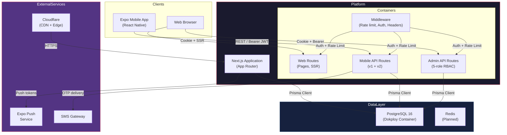
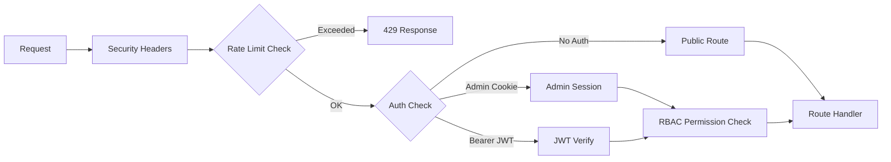
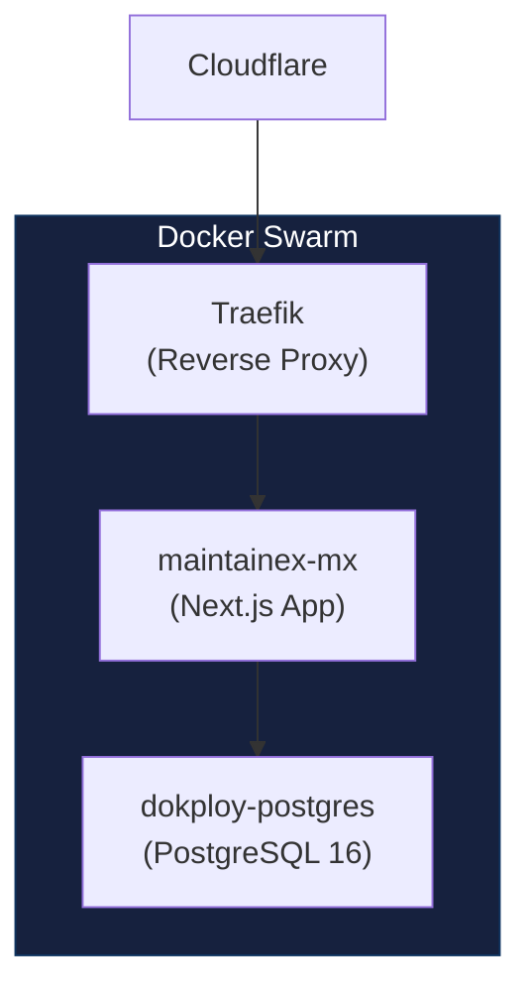

# Container Diagram

C4 Level 2 — Container view of the MaintainEX platform.

---

## Overview

MaintainEX runs as a monolithic Next.js application deployed on Docker Swarm. The Expo mobile app communicates via REST API. PostgreSQL is the primary data store. A Redis cache is planned for session management and rate limiting.

---

## Container Diagram

---

## Container Details

### Next.js Application

| Property | Value |
|---|---|
| Framework | Next.js 14 (App Router) |
| Runtime | Node.js 20 (slim) |
| Port | 3000 |
| Environment | `NODE_ENV=production` |
| Process | `npx prisma migrate deploy && npm start` |

The application is a single deployable unit serving three distinct route groups:

1. **Web Routes** (`app/`) — Public website, customer portal, SEO pages
2. **Mobile API** (`app/api/mobile/`) — REST API for Expo app (v1 legacy + v2)
3. **Admin API** (`app/api/admin/`) — Internal admin panel API

### PostgreSQL Database

| Property | Value |
|---|---|
| Version | PostgreSQL 16 (Alpine) |
| Host | `dokploy-postgres` container |
| Connection | Prisma ORM (connection pooling via Prisma) |
| Backup | Via Docker volume (`postgres_data`) |

Schema is defined in `prisma/schema.prisma` (3385+ lines, 40+ models). Key domain tables:

- `User`, `Admin`, `AdminSession` — Identity and auth
- `MarketplaceJob`, `JobQuote`, `JobWorkspace` — Job lifecycle
- `JobEscrow`, `LedgerTransaction`, `LedgerEntry` — Financial
- `ProviderOpportunity`, `MarketConfig` — Matching engine
- `ServiceTemplate`, `TemplateJob` — Pricing

### Expo Mobile App

| Property | Value |
|---|---|
| Framework | Expo / React Native |
| API Base URL | `EXPO_PUBLIC_API_URL=https://maintainex.lk` |
| Auth | JWT Bearer token (18-day TTL) |
| Push | Expo Push Token (registered on app open) |

Located in `apps/mobile/`. Key screens:

- Auth: login, register, OTP verification
- Jobs: create, list, workspace, quotes
- Matching: opportunity notifications, accept/decline
- Payments: escrow status, wallet, withdrawals
- Messaging: conversations, messages
- Settings: profile, identity docs, preferences

---

## Request Flow (Middleware Chain)

All incoming requests pass through the Next.js middleware before reaching route handlers.

Defined in `middleware.ts:12-36`:

- **Security Headers**: HSTS, X-Frame-Options, CSP, CORS
- **Rate Limits**: default (100/min), auth (5/min), admin (200/min)
- **Auth**: JWT verification via HMAC-SHA256, legacy token support

---

## Networking

| Path | Protocol | Port |
|---|---|---|
| Cloudflare -> Traefik | HTTPS | 443 |
| Traefik -> Next.js | HTTP | 3000 |
| Next.js -> PostgreSQL | TCP | 5432 (internal) |

Docker Swarm manages service discovery. The Next.js container runs as a Swarm service (`maintainex-mx-vcaohy`) with health checks on `/api/health`.

---

## Deployment Topology

See [deployment.md](./deployment.md) for full Docker Swarm details.

---

## References

- System context: [system-context.md](./system-context.md)
- Deployment: [deployment.md](./deployment.md)
- Authentication: [authentication.md](./authentication.md)
