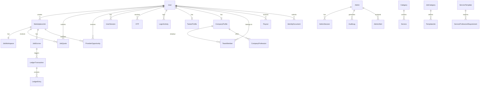

# Data Model

Core domain models, relationships, and key enums. Full schema: `prisma/schema.prisma` (3385+ lines, 40+ models).

---

## Top 10 Domain Models

### 1. User

The central identity model. All actors (customer, provider, company owner) share this model.

```
User
  id                String    @id @default(cuid())
  mxId              String?   @unique    // MXU-XXXXX
  email             String    @unique
  passwordHash      String
  name              String
  phone             String?              // E.164 format
  role              String    @default("CUSTOMER")  // CUSTOMER | PROVIDER
  countryCode       String    @default("LK")
  isActive          Boolean   @default(true)
  isSuspended       Boolean   @default(false)
  isBanned          Boolean   @default(false)
  identityStatus    String    @default("NOT_SUBMITTED") // KYC status
  pushToken         String?              // Expo push token
```

Key relationships: `sessions`, `otps`, `taskerProfile`, `companyProfile`, `teamMembers`, `payouts`, `identityDocs`

### 2. MarketplaceJob

The core transactional entity. Represents a customer's service request.

```
MarketplaceJob
  id                String    @id
  customerId        String    // FK -> User
  categoryId        String    // FK -> JobCategory
  serviceTemplateId String?   // FK -> ServiceTemplate
  status            String    // OPEN | QUOTE_ACCEPTED | IN_PROGRESS | COMPLETED | CANCELLED
  countryCode       String    // ISO 3166-1 alpha-2
  currentWave       Int?      // Current matching wave (1-3)
  waveSentAt        DateTime? // When current wave was sent
  description       String?
  latitude          Float?
  longitude         Float?
```

State machine defined in `lib/domain/job-lifecycle.ts:44-50`:
```
OPEN -> QUOTE_ACCEPTED -> IN_PROGRESS -> COMPLETED
OPEN -> CANCELLED
QUOTE_ACCEPTED -> CANCELLED
IN_PROGRESS -> CANCELLED
```

### 3. JobQuote

Provider's price proposal for a job.

```
JobQuote
  id              String    @id
  jobId           String    // FK -> MarketplaceJob
  providerId      String    // FK -> User or CompanyProfile
  providerType    String    // INDIVIDUAL | COMPANY
  price           BigInt    // In minor units (cents)
  status          String    // PENDING | ACCEPTED | REJECTED | WITHDRAWN
  description     String?
```

### 4. JobWorkspace

Tracks the execution progress of an accepted job.

```
JobWorkspace
  id                    String    @id
  jobId                 String    @unique // FK -> MarketplaceJob
  progressStatus        String    // ACCEPTED | IN_PROGRESS | WAITING_CUSTOMER | COMPLETION_REQUESTED | COMPLETED | DISPUTED
  completionRequestedAt DateTime?
```

State machine defined in `lib/domain/job-lifecycle.ts:52-59`:
```
ACCEPTED -> IN_PROGRESS -> WAITING_CUSTOMER -> COMPLETION_REQUESTED -> COMPLETED
Any non-terminal state -> DISPUTED
```

### 5. JobEscrow

Financial escrow for a job. Tracks payment lifecycle.

```
JobEscrow
  id            String    @id
  jobId         String    // FK -> MarketplaceJob
  quoteId       String?   // FK -> JobQuote
  providerId    String?   // FK -> User
  amount        BigInt    // Provider gross amount
  serviceFee    BigInt    // Platform commission
  totalAmount   BigInt    // Customer total
  currency      String    // ISO 4217
  paymentMethod String    // CARD | CASH
  status        String    // PENDING_PAYMENT | PROTECTED | ON_HOLD | RELEASED | REFUNDED | CANCELLED
  heldAt        DateTime?
  releasedAt    DateTime?
  settledAt     DateTime?
```

### 6. ProviderOpportunity

Matching engine output — a wave-based opportunity sent to a provider.

```
ProviderOpportunity
  id                String    @id
  jobId             String    // FK -> MarketplaceJob
  taskerId          String?   // FK -> User (for INDIVIDUAL)
  companyId         String?   // FK -> CompanyProfile (for COMPANY)
  providerType      String    // INDIVIDUAL | COMPANY
  waveNumber        Int       // 1, 2, or 3
  status            String    // PENDING | SENT | VIEWED | ACCEPTED | DECLINED | EXPIRED
  sentAt            DateTime?
  expiresAt         DateTime?
  respondedAt       DateTime?
  rankAtSend        Int?
  scoreSnapshot     Int?
```

### 7. Admin

Admin staff identity with role-based access.

```
Admin
  id              String    @id
  email           String    @unique
  password        String
  name            String?
  role            String    @default("ADMIN")
  region          String    @default("LK")
  isActive        Boolean   @default(true)
```

### 8. AdminSession

Server-side session for admin JWT management.

```
AdminSession
  id              String    @id
  adminId         String    // FK -> Admin
  accessTokenJti  String    @unique // JWT ID for revocation
  refreshTokenHash String?
  ipAddress       String?
  userAgent       String?
  expiresAt       DateTime
  revokedAt       DateTime?
  createdAt       DateTime  @default(now())
```

### 9. LedgerTransaction / LedgerEntry

Double-entry financial ledger.

```
LedgerTransaction
  id                String    @id
  referenceType     String    // "escrow_release" | "commission" | etc.
  referenceId       String    // FK to source entity
  idempotencyKey    String    @unique
  currency          String    @default("LKR")
  description       String?
  createdBy         String
  metadata          String?   // Payload fingerprint

LedgerEntry
  id              String    @id
  transactionId   String    // FK -> LedgerTransaction
  accountId       String    // Account identifier
  accountType     String    // "customer" | "provider" | "platform"
  entryType       String    // CREDIT | DEBIT
  amount          BigInt
```

### 10. MarketConfig

Country-level configuration for matching and pricing.

```
MarketConfig
  countryCode       String    @id
  defaultCurrency   String    @default("LKR")
  pricingVersion    String    @default("v1")
  commissionRateBps Int       @default(1000)  // 10%
  weightCapability  Int       @default(30)
  weightReliability Int       @default(20)
  weightReputation  Int       @default(20)
  weightAvailability Int     @default(15)
  weightTravel      Int       @default(10)
  weightExperience  Int       @default(5)
  wave1Size         Int       @default(3)
  wave2Size         Int       @default(5)
  wave3Size         Int       @default(8)
```

---

## Key Enums

| Enum | Values | Used In |
|---|---|---|
| `JobStatus` | `OPEN`, `QUOTE_ACCEPTED`, `IN_PROGRESS`, `COMPLETED`, `CANCELLED` | `MarketplaceJob.status` |
| `QuoteStatus` | `PENDING`, `ACCEPTED`, `REJECTED`, `WITHDRAWN` | `JobQuote.status` |
| `WorkspaceStatus` | `ACCEPTED`, `IN_PROGRESS`, `WAITING_CUSTOMER`, `COMPLETION_REQUESTED`, `COMPLETED`, `DISPUTED` | `JobWorkspace.progressStatus` |
| `EscrowStatus` | `PENDING_PAYMENT`, `PROTECTED`, `ON_HOLD`, `RELEASED`, `REFUNDED`, `CANCELLED` | `JobEscrow.status` |
| `ActorType` | `CUSTOMER`, `PROVIDER`, `COMPANY`, `STAFF`, `SYSTEM` | Job transitions |
| `ProviderType` | `INDIVIDUAL`, `COMPANY` | Matching, quotes |
| `OpportunityStatus` | `PENDING`, `SENT`, `VIEWED`, `ACCEPTED`, `DECLINED`, `EXPIRED`, `WITHDRAWN`, `CANCELLED` | Matching |
| `AdminRole` | `SUPER_ADMIN`, `MANAGER`, `FINANCE`, `USER_MANAGEMENT`, `SUPPORT`, `TECHNICAL` | RBAC |

---

## Entity Relationship Summary



---

## Key Design Decisions

1. **BigInt for money** — All monetary values stored as `bigint` to avoid floating-point errors. Converted to safe numbers only at the API boundary (`lib/money.ts`).

2. **Soft deletes via status** — No physical deletes on core entities. Status fields (`isActive`, `isSuspended`, `isBanned`) control visibility.

3. **Polymorphic provider** — `providerId` on `JobQuote` and `ProviderOpportunity` references either `User` (INDIVIDUAL) or `CompanyProfile` (COMPANY), distinguished by `providerType`.

4. **Idempotency on ledger** — Every `LedgerTransaction` requires a unique `idempotencyKey` to prevent duplicate postings (`lib/ledger.ts:75-77`).

5. **Country-aware config** — `MarketConfig` keyed by `countryCode` allows per-country matching weights, pricing, and wave sizes. Falls back to `GLOBAL` if country-specific config not found.

---

## References

- Full schema: `prisma/schema.prisma`
- Job lifecycle: [data-model.md](./data-model.md), `lib/domain/job-lifecycle.ts`
- Ledger: [financial-ledger.md](./financial-ledger.md), `lib/ledger.ts`
- Matching config: `lib/matching/config.ts`
- Pricing config: `lib/pricing/rules.ts`
