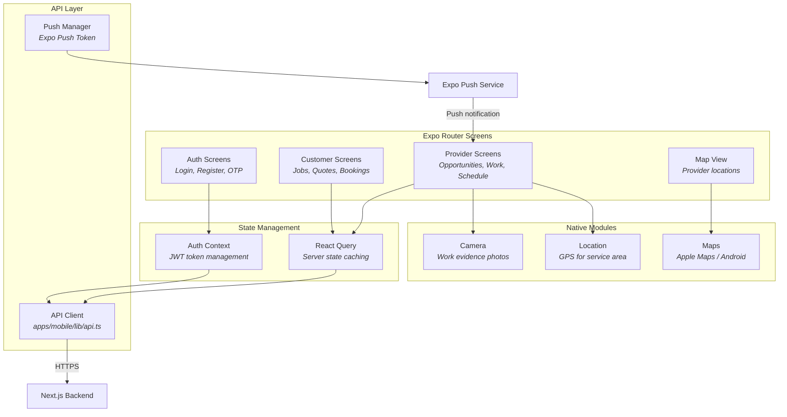
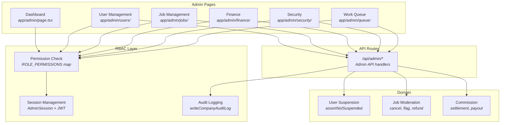

# Component Diagram

Mermaid component diagrams for MaintainEX subsystems. Render with any Mermaid-compatible viewer.

---

## Marketplace API Components

```mermaid
graph TB
    subgraph "API Route Layer"
        JobRoutes["Job Routes<br/><i>/api/mobile/v2/jobs/*</i>"]
        QuoteRoutes["Quote Routes<br/><i>/api/mobile/v2/quotes/*</i>"]
        EscrowRoutes["Escrow Routes<br/><i>/api/mobile/v2/jobs/[id]/escrow/*</i>"]
        MatchRoutes["Match Routes<br/><i>/api/mobile/v2/match/*</i>"]
        PricingRoutes["Pricing Routes<br/><i>/api/mobile/v2/pricing/*</i>"]
        PinRoutes["PIN Routes<br/><i>/api/mobile/v2/jobs/[id]/pin/*</i>"]
    end

    subgraph "Auth Middleware"
        SessionCheck["Session Check<br/><i>getSessionFromCookie</i>"]
        SuspendCheck["Suspend Check<br/><i>assertNotSuspended</i>"]
        RBACCheck["RBAC Check<br/><i>getAdminSession</i>"]
    end

    subgraph "Domain Services"
        JobLifecycle["Job Lifecycle<br/><i>lib/domain/job-lifecycle.ts</i>"]
        CompanyAssignment["Company Assignment<br/><i>lib/domain/company-job-assignment.ts</i>"]
        CommercialImmut["Commercial Immutability<br/><i>lib/domain/commercial-immutability.ts</i>"]
    end

    subgraph "Matching Subsystem"
        Eligibility["Eligibility Engine<br/><i>lib/matching/eligibility.ts</i>"]
        Scoring["Scoring Engine<br/><i>lib/matching/scoring.ts</i>"]
        Waves["Wave Manager<br/><i>lib/matching/waves.ts</i>"]
        Ranking["Ranking<br/><i>lib/matching/ranking.ts</i>"]
    end

    subgraph "Pricing Subsystem"
        PricingEngine["Price Calculator<br/><i>lib/pricing/engine.ts</i>"]
        PricingRules["Rules Resolver<br/><i>lib/pricing/rules.ts</i>"]
        FeeCalc["Fee Calculator<br/><i>lib/pricing/fees.ts</i>"]
    end

    subgraph "Financial Subsystem"
        Ledger["Double-Entry Ledger<br/><i>lib/ledger.ts</i>"]
        EscrowLifecycle["Escrow Lifecycle<br/><i>job-lifecycle.ts</i>"]
        Commission["Commission Calc<br/><i>lib/mxid.ts</i>"]
    end

    subgraph "Data Layer"
        Prisma["Prisma Client"]
        PostgreSQL[("PostgreSQL")]
    end

    %% Route to Auth
    JobRoutes --> SessionCheck
    JobRoutes --> SuspendCheck
    QuoteRoutes --> SessionCheck
    QuoteRoutes --> SuspendCheck
    EscrowRoutes --> SessionCheck
    EscrowRoutes --> SuspendCheck
    MatchRoutes --> SessionCheck
    PricingRoutes --> SessionCheck
    PinRoutes --> SessionCheck

    AdminRoutes["Admin Routes"] --> RBACCheck

    %% Route to Domain
    JobRoutes --> JobLifecycle
    JobRoutes --> CommercialImmut
    QuoteRoutes --> CommercialImmut
    QuoteRoutes --> JobLifecycle
    EscrowRoutes --> EscrowLifecycle
    PinRoutes --> JobLifecycle

    %% Domain to Matching
    MatchRoutes --> Eligibility
    MatchRoutes --> Scoring
    MatchRoutes --> Waves
    MatchRoutes --> Ranking

    %% Route to Pricing
    PricingRoutes --> PricingEngine
    PricingEngine --> PricingRules
    PricingEngine --> FeeCalc

    %% Financial
    EscrowRoutes --> Ledger
    JobLifecycle --> Ledger
    Ledger --> Commission

    %% Company Assignment
    JobRoutes --> CompanyAssignment

    %% All to Prisma
    JobLifecycle --> Prisma
    Eligibility --> Prisma
    Scoring --> Prisma
    Waves --> Prisma
    PricingEngine --> Prisma
    Ledger --> Prisma
    CompanyAssignment --> Prisma

    Prisma --> PostgreSQL
```

---

## Mobile App Components

---

## Admin Panel Components

