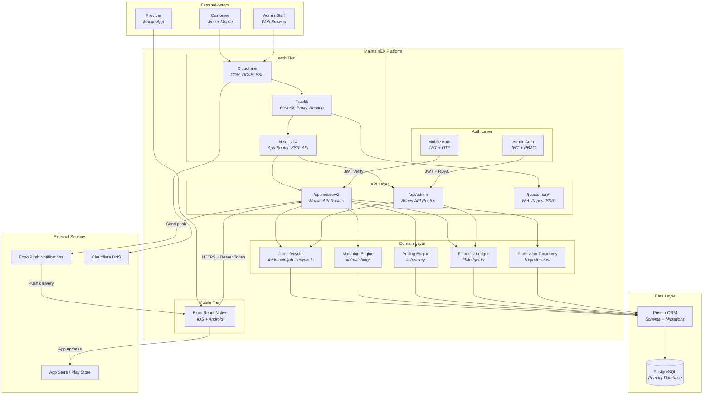

# Container Diagram

C4 Container diagram for MaintainEX. Render with any Mermaid-compatible viewer.

---

## Diagram Source

---

## Legend

| Shape | Meaning |
|-------|---------|
| Rectangle | Software system or container |
| Cylinder | Database |
| Subgraph | Logical boundary |
| Arrow | Data flow or dependency |

---

## Key Relationships

- **Customer** interacts via web (Cloudflare -> Traefik -> Next.js) or mobile (Expo -> API)
- **Provider** interacts primarily via mobile app
- **Admin Staff** interacts via web admin panel
- All API routes share the same domain layer
- Prisma ORM is the sole database access layer
- PostgreSQL is the only database (no Redis, no message queue)
