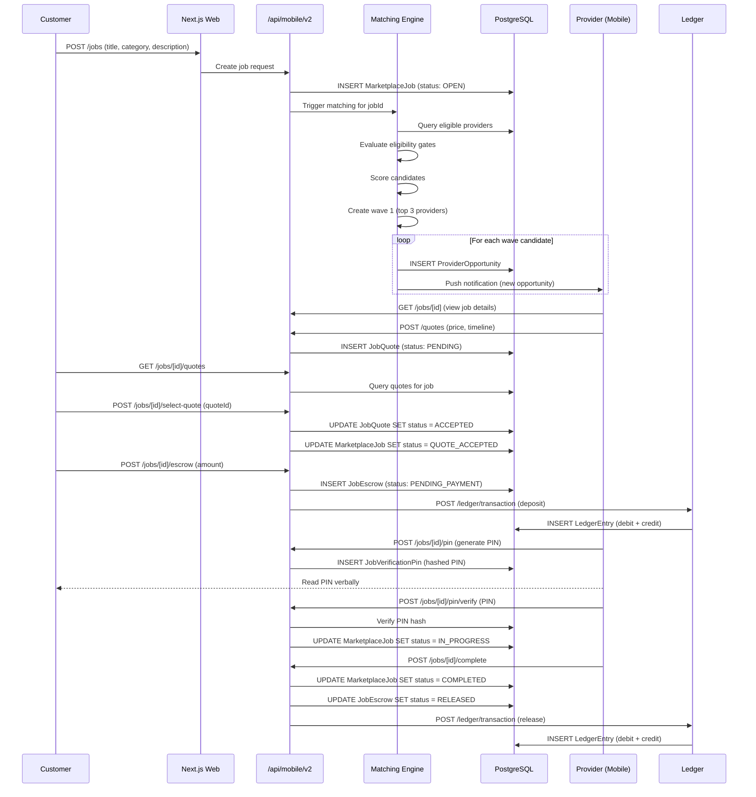
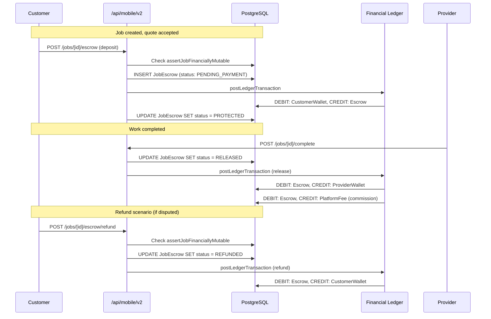
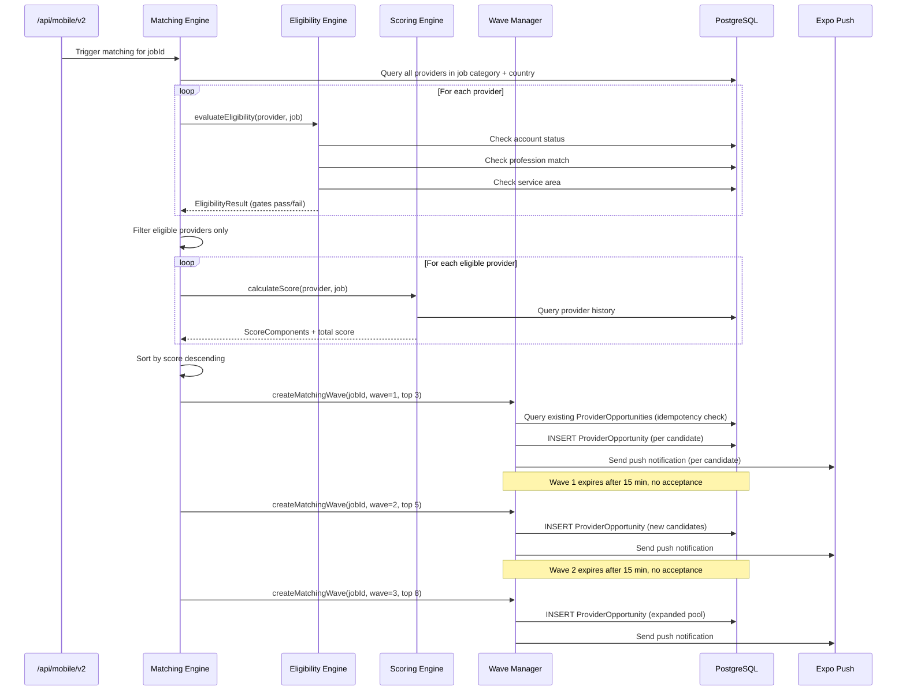
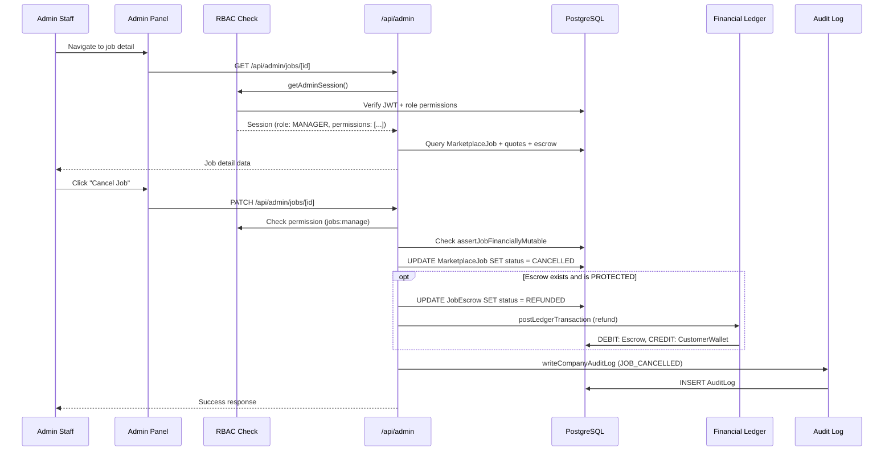
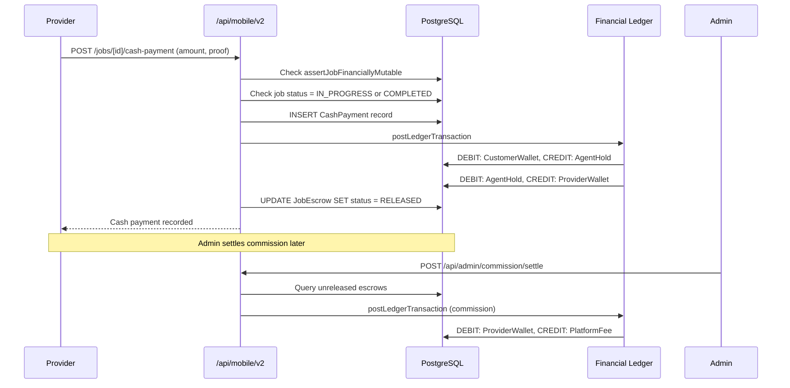

# Data Flow Diagrams

Mermaid sequence diagrams for key MaintainEX flows. Render with any Mermaid-compatible viewer.

---

## Booking Flow (Customer Posts Job, Provider Accepts)

---

## Payment Flow (Escrow Lifecycle)

---

## Matching Flow (Wave Progression)

---

## Admin Job Moderation Flow

---

## Cash-to-Agent Payment Flow

