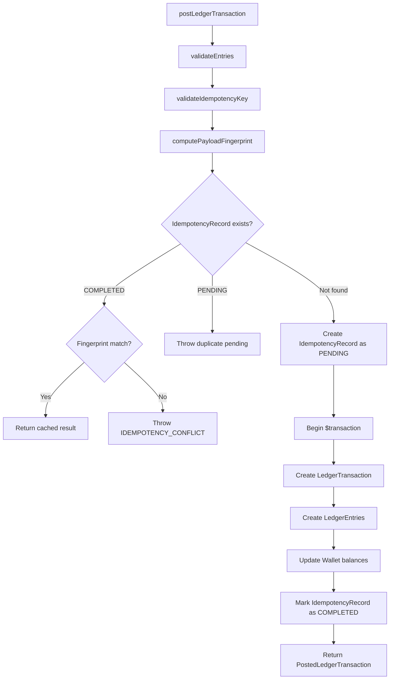
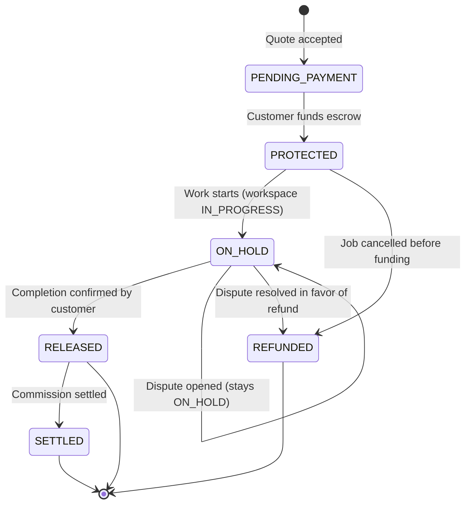
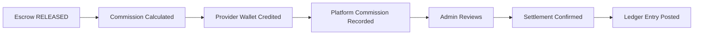

# Financial Ledger

Double-entry ledger, escrow lifecycle, commission calculation, settlement, and payout.

---

## Overview

MaintainEX uses a double-entry accounting ledger for all financial movements. Every transaction requires balanced debit and credit entries, an idempotency key, and a reference to the source entity.

Source: `lib/ledger.ts` (447 lines)

---

## Double-Entry Ledger

### Core Properties

1. **Balanced entries** — Total debits must equal total credits for every transaction
2. **Idempotency** — Each transaction requires a unique `idempotencyKey`
3. **Immutability** — Posted entries cannot be modified, only reversed
4. **Fingerprinting** — Payload fingerprint detects conflicting idempotency key reuse

### Ledger Transaction Structure

```typescript
interface PostLedgerTransactionInput {
  entries: LedgerEntry[]           // Min 2 entries
  referenceType: string            // "escrow_release" | "commission" | etc.
  referenceId: string              // FK to source entity
  idempotencyKey: string           // Unique per operation
  currency?: Currency              // ISO 4217, default "LKR"
  description?: string
  createdBy: string                // Actor ID
  metadata?: string
}

interface LedgerEntry {
  accountId: string                // Account identifier
  accountType: string              // "customer" | "provider" | "platform"
  entryType: 'CREDIT' | 'DEBIT'
  amount: bigint                   // Must be > 0
}
```

### Posting Flow

Defined in `lib/ledger.ts:112-150`:



### Validation Rules (`ledger.ts:53-73`)

- Minimum 2 entries per transaction
- Total credits must equal total debits (balanced)
- Non-zero amounts required
- All entries must have `accountId` and `accountType`
- All amounts must be positive

---

## Escrow Lifecycle

### State Machine



### Escrow States

| State | Description | Next States |
|---|---|---|
| `PENDING_PAYMENT` | Quote accepted, awaiting customer payment | `PROTECTED`, `REFUNDED`, `CANCELLED` |
| `PROTECTED` | Customer funds held in escrow | `ON_HOLD`, `REFUNDED` |
| `ON_HOLD` | Work in progress, funds still held | `RELEASED`, `REFUNDED` |
| `RELEASED` | Funds released to provider | `SETTLED` |
| `REFUNDED` | Funds returned to customer | Terminal |
| `SETTLED` | Commission deducted, provider paid | Terminal |

### Escrow Creation

When a quote is accepted (`lib/domain/job-lifecycle.ts:136-199`):

1. Validate job is `OPEN` and quote is `PENDING`
2. Resolve pricing config for job's country
3. Calculate service fee: `quote.price * commissionRateBps / 10000`
4. Calculate total: `quote.price + serviceFee`
5. Create/update `JobEscrow` record
6. Reject all other pending quotes
7. Create `JobWorkspace` with status `ACCEPTED`
8. Transition job to `QUOTE_ACCEPTED`

---

## Commission

### Calculation

```
serviceFee = quotePrice * commissionRateBps / 10000
providerGross = quotePrice
customerTotal = providerGross + serviceFee
```

Default commission: 1000 bps (10%). Configurable per country via `MarketConfig`.

### Cash-to-Agent Commission

Special flow for cash payments:

1. Customer pays provider in cash
2. Provider owes commission to platform
3. Commission tracked separately from escrow
4. Admin can settle via `/v2/admin/commission-settle`

---

## Wallet System

### Wallet Types

| Wallet | Account Prefix | Purpose |
|---|---|---|
| Customer Wallet | `customer:` | Customer balance (refunds, credits) |
| Provider Wallet | `provider:` | Provider earnings |
| Platform Wallet | `platform:` | Commission revenue |

### Wallet Resolution

Defined in `lib/ledger.ts:96-110`:

Account IDs use prefix notation:
- `customer:<userId>` -> Looks up `CustomerWallet` by userId
- `provider:<userId>` -> Looks up `ProviderWallet` by userId
- Direct UUID -> Used as wallet ID directly

### Balance Updates

Wallet balances are updated within the same database transaction as ledger entries:

```sql
UPDATE "CustomerWallet" SET amount = amount + <credit_amount> WHERE id = <wallet_id>
UPDATE "ProviderWallet" SET amount = amount - <debit_amount> WHERE id = <wallet_id>
```

---

## Settlement

### Commission Settlement Flow



### Settlement Triggers

- Automatic on escrow release
- Manual admin settlement for cash-to-agent
- Batch settlement via admin API

---

## Payout

Provider withdrawals:

1. Provider requests withdrawal via `POST /withdraw`
2. System checks wallet balance >= withdrawal amount
3. Deducts from provider wallet
4. Creates payout record
5. Admin processes payout manually (bank transfer)

---

## Idempotency

### Key Requirements

- Unique per operation (max 255 characters)
- Stored in `IdempotencyRecord` table
- 30-day expiry

### Conflict Detection

If same `idempotencyKey` is reused with different payload:

```
IDEMPOTENCY_CONFLICT: key=<key>
```

This prevents accidental double-posting with different amounts.

### Concurrent Duplicate Handling

If `IdempotencyRecord` exists with status `PENDING`:
- Throw error (concurrent duplicate in progress)

If `IdempotencyRecord` exists with status `COMPLETED`:
- Compare fingerprint
- If matching: return cached result (idempotent replay)
- If different: throw conflict error

---

## Ledger Entry Naming Convention

| Reference Type | Description |
|---|---|
| `escrow_deposit` | Customer funds escrow |
| `escrow_release` | Escrow released to provider |
| `escrow_refund` | Escrow refunded to customer |
| `commission_settle` | Commission deducted |
| `provider_payout` | Provider withdrawal |
| `wallet_credit` | Wallet credit (refund, bonus) |
| `wallet_debit` | Wallet debit (withdrawal) |

---

## Audit Trail

Every ledger transaction records:
- `createdBy` — Actor who initiated the transaction
- `referenceType` + `referenceId` — Source entity
- `idempotencyKey` — Unique operation identifier
- `metadata` — Payload fingerprint
- Timestamps on both transaction and entries

Queryable via admin API for financial auditing.

---

## References

- Ledger: `lib/ledger.ts`
- Money utilities: `lib/money.ts`
- Job lifecycle: `lib/domain/job-lifecycle.ts`
- Pricing rules: `lib/pricing/rules.ts`
- Escrow API: `app/api/mobile/v2/jobs/[id]/release-escrow/route.ts`
- Commission settle: `app/api/mobile/v2/admin/commission-settle/route.ts`
