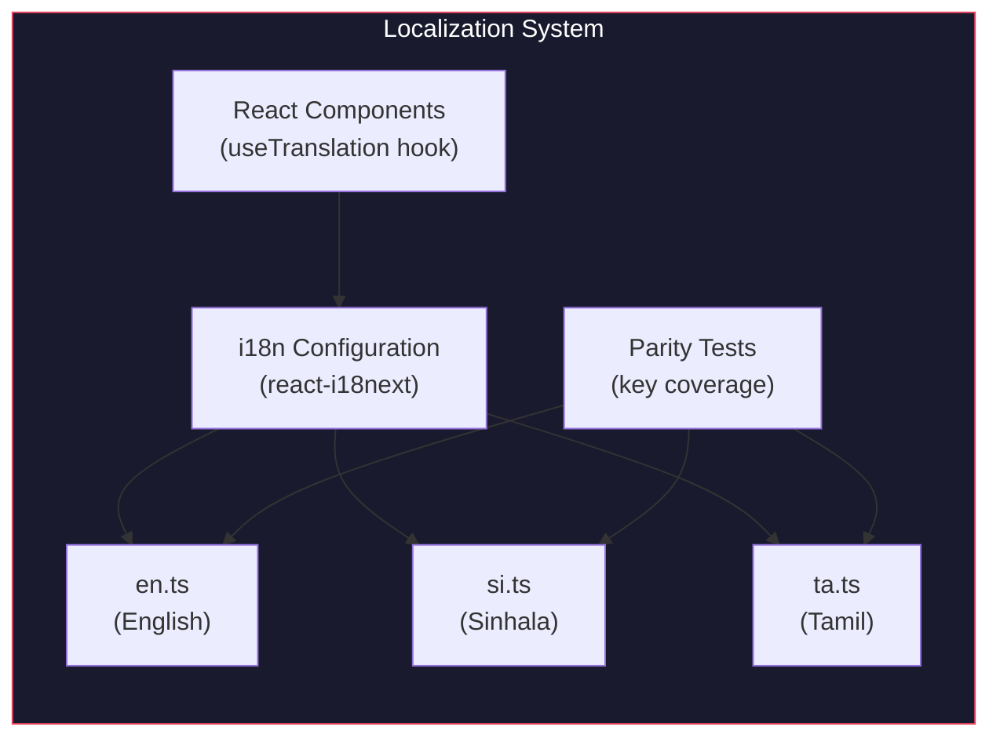

# Localization

i18n framework, locale files, RTL support, and parity testing.

---

## Overview

MaintainEX supports three languages for the mobile application: English, Sinhala, and Tamil. The web application currently uses English only. Localization is implemented via `react-i18next` in the Expo mobile app.

---

## Supported Locales

| Code | Language | Script | RTL |
|---|---|---|---|
| `en` | English | Latin | No |
| `si` | Sinhala | Sinhala | No |
| `ta` | Tamil | Tamil | No |

---

## Architecture



---

## File Structure

```
apps/mobile/lib/i18n/
  index.ts              # i18n initialization
  locales/
    en.ts               # English translations
    si.ts               # Sinhala translations
    ta.ts               # Tamil translations
  __tests__/
    i18n.test.ts         # Translation validation
    i18n-parity.test.ts  # Key coverage parity
```

---

## Configuration

Defined in `apps/mobile/lib/i18n/index.ts`:

```typescript
import i18n from 'i18next'
import { initReactI18next } from 'react-i18next'
import en from './locales/en'
import si from './locales/si'
import ta from './locales/ta'

i18n.use(initReactI18next).init({
  resources: {
    en: { translation: en },
    si: { translation: si },
    ta: { translation: ta },
  },
  lng: 'en',           // Default language
  fallbackLng: 'en',   // Fallback to English
  interpolation: {
    escapeValue: false, // React handles XSS
  },
})
```

### Type Declarations

TypeScript declarations in `apps/mobile/@types/react-i18next.d.ts` ensure type safety for translation keys.

---

## Usage in Components

### useTranslation Hook

```typescript
import { useTranslation } from 'react-i18next'

function MyComponent() {
  const { t } = useTranslation()
  return <Text>{t('jobs.create.title')}</Text>
}
```

### Namespace Support

Translations can be organized by namespace:

```typescript
const { t } = useTranslation('jobs')
return <Text>{t('create.title')}</Text>
```

---

## Translation Key Structure

Keys follow dot-notation with logical grouping:

```
auth.login.title
auth.login.phonePlaceholder
auth.login.sendOtp
auth.register.title
auth.register.selectRole
jobs.create.title
jobs.create.selectCategory
jobs.create.description
jobs.detail.status
jobs.detail.quotes
payments.escrow.status
payments.wallet.balance
settings.profile.edit
settings.language.select
common.save
common.cancel
common.loading
```

---

## RTL Support

Sinhala and Tamil are not RTL scripts, so no special RTL layout handling is required. If RTL languages are added in the future:

1. Detect script direction from locale
2. Apply `I18nManager.forceRTL(isRTL)` in React Native
3. Use logical properties in styles (`marginStart` vs `marginLeft`)

---

## Parity Testing

Defined in `apps/mobile/lib/i18n/__tests__/i18n-parity.test.ts`:

### Purpose

Ensures all locale files have the same keys. Missing translations in any locale cause test failure.

### Test Logic

```typescript
function getKeys(obj: Record<string, any>, prefix = ''): string[] {
  return Object.entries(obj).flatMap(([key, value]) => {
    const fullKey = prefix ? `${prefix}.${key}` : key
    if (typeof value === 'object' && value !== null) {
      return getKeys(value, fullKey)
    }
    return fullKey
  })
}

it('should have all keys in all locales', () => {
  const enKeys = getKeys(en).sort()
  const siKeys = getKeys(si).sort()
  const taKeys = getKeys(ta).sort()

  expect(siKeys).toEqual(enKeys)
  expect(taKeys).toEqual(enKeys)
})
```

### Running Tests

```bash
cd apps/mobile
npm test -- --testPathPattern i18n
```

---

## Language Switching

Users can change language in Settings:

1. Navigate to Settings screen
2. Select "Language"
3. Choose from: English, Sinhala, Tamil
4. App re-renders with new locale
5. Preference persisted to device storage

### Language Detection

On app launch:
1. Check stored language preference
2. If none, use device locale
3. Fall back to English

---

## Translation Workflow

### Adding New Keys

1. Add key to `en.ts` with English text
2. Add same key to `si.ts` with Sinhala text
3. Add same key to `ta.ts` with Tamil text
4. Run parity tests to verify coverage
5. Use `t('key.path')` in components

### Translation Guidelines

- Keep translations concise for mobile screens
- Use parameterized translations for dynamic content: `t('jobs.count', { count: 5 })`
- Avoid string concatenation in translations
- Use interpolation for user names, dates, amounts

---

## Web Localization

The web application (`app/`) currently uses English only. To add web i18n:

1. Install `next-intl` or `react-i18next` for Next.js
2. Create locale files in `public/locales/`
3. Configure middleware for locale detection
4. Add language switcher to navigation

---

## Future Improvements

| Area | Current | Proposed |
|---|---|---|
| Web i18n | English only | Add Sinhala/Tamil |
| Pluralization | Not implemented | Add count-based forms |
| Date/Number formatting | Manual | Use `Intl` API |
| Missing translations | Silent fallback | Log warnings in dev |
| Translation management | Manual file edits | Integration with Crowdin/Phrase |

---

## References

- i18n config: `apps/mobile/lib/i18n/index.ts`
- English locale: `apps/mobile/lib/i18n/locales/en.ts`
- Sinhala locale: `apps/mobile/lib/i18n/locales/si.ts`
- Tamil locale: `apps/mobile/lib/i18n/locales/ta.ts`
- Parity tests: `apps/mobile/lib/i18n/__tests__/i18n-parity.test.ts`
- Type declarations: `apps/mobile/@types/react-i18next.d.ts`
