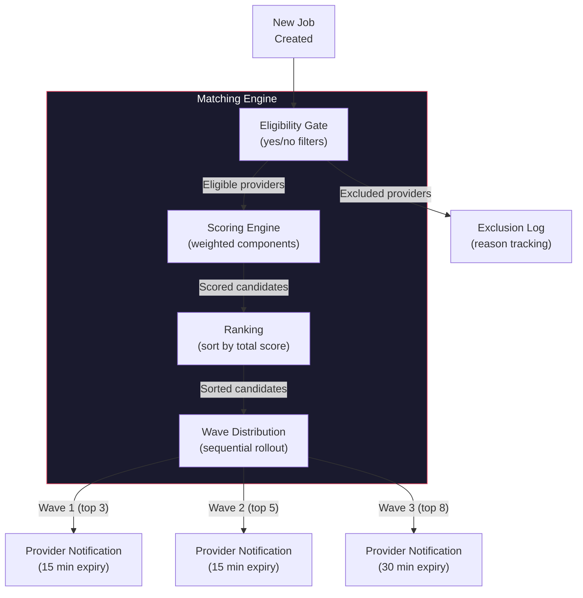
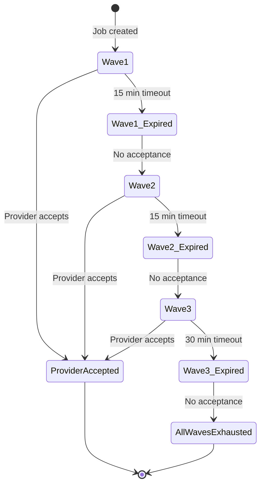

# Matching Engine

Provider matching algorithm: eligibility gates, scoring, wave distribution, and fairness.

---

## Overview

The matching engine connects jobs with eligible providers through a multi-wave distribution system. It evaluates providers against eligibility gates, scores qualified candidates, and distributes opportunities in waves with configurable sizes and expiry times.

Source: `lib/matching/` (8 files)

---

## Architecture



---

## Eligibility Gates

Defined in `lib/matching/eligibility.ts:22-189`. Each provider must pass ALL gates.

### Individual Provider Gates

| Gate | Check | Failure Reason |
|---|---|---|
| `ACCOUNT_EXISTS` | User record exists | Provider not found |
| `ACCOUNT_ACTIVE` | `isActive === true` | Account inactive |
| `NOT_SUSPENDED` | `isSuspended === false` | Account suspended |
| `NOT_BANNED` | `isBanned === false` | Account banned |
| `IDENTITY_VERIFIED` | `identityStatus === 'VERIFIED'` | Identity not verified |
| `PROVIDER_PROFILE` | TaskerProfile exists | No provider profile |
| `PROVIDER_VERIFIED` | `verificationStatus === 'VERIFIED'` | Provider not verified |
| `PROFESSION_MATCH` | Approved profession matches job | No matching capability |
| `JURISDICTION_CREDENTIAL` | Required credentials verified | Missing jurisdiction credential |
| `SERVICE_AREA` | Provider country matches job country | Outside service area |
| `NO_CONFLICT` | No active in-progress jobs | Active job conflict |
| `QUALITY_FLOOR` | Rating >= 3.0 (or 0 completed jobs) | Quality floor not met |

### Company Provider Gates

| Gate | Check | Failure Reason |
|---|---|---|
| `COMPANY_EXISTS` | CompanyProfile exists | Company not found |
| `COMPANY_OWNER_ACTIVE` | Owner not suspended/banned | Owner suspended |
| `COMPANY_VERIFIED` | `verificationStatus === 'VERIFIED'` | Company not verified |
| `COMPANY_SUBSCRIPTION` | `subscriptionStatus !== 'CANCELLED'` | Subscription cancelled |
| `COMPANY_OWNER_EXISTS` | Active COMPANY_OWNER member exists | No active owner |
| `COMPANY_PROFESSION_MATCH` | Company profession matches job | No matching capability |

### Profession Matching

Service profession requirements are defined per `ServiceTemplate`. Each requirement specifies:

- **Required All**: Provider must have ALL listed skills
- **Required Any Of**: Provider must have at least ONE listed skill
- **Preferred**: Bonus skills (used in scoring, not gating)

Alternative groups allow matching against ANY group of professions.

---

## Scoring Engine

Defined in `lib/matching/scoring.ts`. All scores are 0-100 integers.

### Score Components

| Component | Weight | Computation |
|---|---|---|
| `capability` | 30 | Skill match ratio (0-100) |
| `reliability` | 20 | Completion rate + volume score |
| `reputation` | 20 | Rating/5 * 80 + confidence bonus |
| `availability` | 15 | Available flag + no conflicts + response rate |
| `travel` | 10 | Distance-based (Haversine formula) |
| `experience` | 5 | Relevant jobs + years active |
| `fairness` | 0 | Opportunity distribution equity |
| `preferredSkill` | 0 | Preferred skills matched ratio |

### Capability Score (`scoring.ts:27-43`)

```
if (serviceTemplateId matches provider skills) -> 100
else if (categoryId matches) -> 70
else -> 30

if (categoryId matches provider skills) -> 100
else -> 20
```

### Reliability Score (`scoring.ts:45-53`)

```
completionRate = 1 - cancellationRate
volumeScore = min(100, completedJobs * 2)
score = completionRate * 70 + (volumeScore / 100) * 30
New providers (0 jobs) get baseline of 50.
```

### Reputation Score (`scoring.ts:55-63`)

```
ratingScore = (rating / 5) * 80
confidenceBonus = min(20, reviewCount * 2)
score = ratingScore + confidenceBonus
No reviews = baseline 50.
```

### Travel Score (`scoring.ts:77-90`)

```
Remote job -> 100
No service area defined -> 50
Distance <= 5km -> 100
Distance <= 10km -> 85
Distance <= 20km -> 70
Distance <= 50km -> 50
Distance > 50km -> 20
```

### Fairness Score (`scoring.ts:101-134`)

Balances opportunity distribution:
- Boosts providers with fewer recent opportunities (below median)
- Boosts providers who haven't had an opportunity in 7+ days
- Penalizes providers with high win rates (>80%) to prevent concentration

### Total Score (`scoring.ts:154-167`)

```typescript
total = (capability * 30 + reliability * 20 + reputation * 20 +
         availability * 15 + travel * 10 + experience * 5 +
         fairness * 0 + preferredSkill * 0) / 100
```

Weights sum to 100. Configurable per country via `MarketConfig`.

---

## Wave Distribution

Defined in `lib/matching/waves.ts`.

### Wave Configuration

| Wave | Size | Expiry | Purpose |
|---|---|---|---|
| Wave 1 | 3 providers | 15 minutes | Top candidates, quick response |
| Wave 2 | 5 providers | 15 minutes | Extended reach |
| Wave 3 | 8 providers | 30 minutes | Maximum coverage |

### Wave Lifecycle



### Opportunity Creation (`waves.ts:17-90`)

1. Take top N candidates for the wave
2. For each candidate, check idempotency (skip if already exists)
3. Create `ProviderOpportunity` record with `SENT` status
4. Send push notification ("New Job Match")
5. Update job's `currentWave` and `waveSentAt`

### Opportunity Response (`waves.ts:157-188`)

Provider can:
- **Accept**: Status -> `ACCEPTED`, triggers quote submission
- **Decline**: Status -> `DECLINED`
- **Expire**: Status -> `EXPIRED` (automatic, via `expireOpportunities()`)

Concurrency-safe: atomic update with status guard.

### Wave Advancement (`waves.ts:127-151`)

Automated process:
1. `expireOpportunities()` finds expired SENT/PENDING opportunities
2. Returns job IDs needing wave advancement
3. `advanceMatchingWave()` increments wave number
4. `createMatchingWave()` sends next wave

---

## Fairness System

### Fairness Signals (`ranking.ts:100-291`)

Batch-optimized (O(1) DB queries regardless of provider count):

- `opportunitiesLast7Days` — Recent opportunity count
- `opportunitiesLast30Days` — Monthly opportunity count
- `jobsWonLast7Days` — Recent wins
- `jobsWonLast30Days` — Monthly wins
- `daysSinceLastOpportunity` — Time since last opportunity
- `daysSinceLastCompletedJob` — Time since last completed job

### New Provider Boost

Providers with <= 10 completed jobs receive a baseline boost:
- 0 jobs: full baseline (50 points)
- 1-10 jobs: linear decay
- 10+ jobs: no boost

---

## Config Resolution

Defined in `lib/matching/config.ts:40-77`:

1. Look up `MarketConfig` by country code
2. If not found, fall back to `GLOBAL` config
3. Validate weights (must sum to 100)
4. Apply defaults for missing fields

Default weights: capability 30, reliability 20, reputation 20, availability 15, travel 10, experience 5, fairness 0, preferredSkill 0.

---

## Exclusion Reasons

26 exclusion reasons defined in `lib/matching/types.ts:7-31`:

```
IDENTITY_NOT_VERIFIED, PROVIDER_SUSPENDED, PROVIDER_BANNED,
PROVIDER_NOT_FOUND, NO_PROVIDER_PROFILE, PROVIDER_VERIFICATION_NOT_APPROVED,
NO_SERVICE_CAPABILITIES, CAPABILITY_MISMATCH, OUTSIDE_SERVICE_AREA,
UNAVAILABLE, ASSIGNMENT_CONFLICT, PROFESSION_MISMATCH, SKILL_MISMATCH,
CREDENTIAL_REQUIRED, JURISDICTION_CREDENTIAL_REQUIRED, QUALITY_FLOOR,
COMPANY_NOT_VERIFIED, COMPANY_OWNER_SUSPENDED, COMPANY_OWNER_BANNED,
NO_ACTIVE_COMPANY_OWNER, COMPANY_SUBSCRIPTION_CANCELLED,
NOT_ACTIVE_COMPANY_MEMBER, CROSS_COMPANY_DENIED, NO_APPROVED_PROFESSION
```

---

## References

- Eligibility: `lib/matching/eligibility.ts`
- Scoring: `lib/matching/scoring.ts`
- Ranking: `lib/matching/ranking.ts`
- Waves: `lib/matching/waves.ts`
- Config: `lib/matching/config.ts`
- Types: `lib/matching/types.ts`
- API endpoint: `app/api/mobile/v2/match/[jobId]/route.ts`
