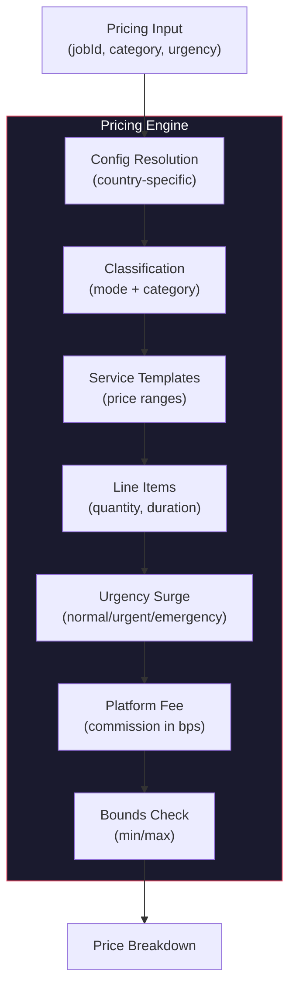

# Pricing Engine

Pricing classification, templates, line items, benchmarks, urgency surge, and country-specific configuration.

---

## Overview

The pricing engine calculates customer-facing prices for jobs. It supports multiple pricing modes (book-now, quote, project, recurring), urgency surges, service modifiers, and country-specific commission rates.

Source: `lib/pricing/` (12 files)

---

## Architecture



---

## Pricing Modes

Defined in `lib/pricing/types.ts:1`:

| Mode | Description | Price Source |
|---|---|---|
| `BOOK_NOW` | Fixed-price, instant booking | Service template average |
| `QUOTE` | Provider-submitted quote | Provider input (validated) |
| `PROJECT` | Project-based pricing | Template + line items |
| `RECURRING` | Recurring service pricing | Template + frequency |

---

## Pricing Input

Defined in `lib/pricing/types.ts:5-16`:

```typescript
interface PricingInput {
  jobId: string
  categoryId: string
  serviceTemplateId?: string
  mode: PricingMode
  urgency: UrgencyLevel        // NORMAL | URGENT | EMERGENCY
  quantity?: number
  durationMinutes?: number
  countryCode?: string
  providerId?: string
  providerType?: 'INDIVIDUAL' | 'COMPANY'
}
```

---

## Price Calculation Flow

### 1. Config Resolution

Defined in `lib/pricing/rules.ts:15-41`:

1. Look up `MarketConfig` by country code
2. Fall back to `GLOBAL` if not found
3. Apply defaults:

| Config Field | Default | Description |
|---|---|---|
| `commissionRateBps` | 1000 | 10% platform fee |
| `urgentModifierBps` | 2500 | 25% urgency surcharge |
| `emergencyModifierBps` | 5000 | 50% emergency surcharge |
| `urgencyCapBps` | 10000 | Max 100% surge cap |
| `minJobAmountCents` | 500 | Minimum price (5.00) |
| `maxJobAmountCents` | 10000000 | Maximum price (100,000.00) |
| `defaultCurrency` | LKR | Sri Lankan Rupee |

### 2. Base Amount Resolution

Defined in `lib/pricing/engine.ts:131-159`:

```
if (serviceTemplateId exists)
  -> Use template's (priceMin + priceMax) / 2
else if (templateJobs exist for category)
  -> Average of top 5 template job price ranges
else
  -> Default: 5000n (50.00)
```

### 3. Urgency Surge

Defined in `lib/pricing/fees.ts:3-15`:

| Urgency | Bps | Effective Surcharge |
|---|---|---|
| `NORMAL` | 0 | 0% |
| `URGENT` | 2500 | 25% |
| `EMERGENCY` | 5000 | 50% |

Surge is capped at `urgencyCapBps` (default 10000 = 100%).

```
surgeAmount = baseAmount * urgencyBps / 10000
cappedSurge = min(surgeAmount, baseAmount * capBps / 10000)
```

### 4. Service Modifiers

Defined in `lib/pricing/engine.ts:161-171`:

- **Quantity**: Extra units beyond 1 add 2000n (20.00) each
- **Duration**: Extra 30-minute blocks beyond 60 minutes add 1500n (15.00) each

### 5. Platform Fee

Defined in `lib/pricing/fees.ts:26-28`:

```
platformFee = providerGross * commissionRateBps / 10000
```

### 6. Total Calculation

```
providerGross = baseAmount + urgencyAmount + serviceModifiers
platformFeeAmount = computePlatformFee(providerGross, commissionRateBps)
customerTotal = providerGross + platformFeeAmount
```

---

## Price Breakdown Output

Defined in `lib/pricing/types.ts:18-29`:

```typescript
interface PriceBreakdown {
  baseAmount: bigint
  urgencyAmount: bigint
  serviceModifiers: bigint
  providerGross: bigint
  platformFeeBps: number
  platformFeeAmount: bigint
  customerTotal: bigint
  currency: string
  pricingVersion: string
  ruleIds: string[]         // Applied pricing rules
}
```

All amounts in minor units (cents). Currency ISO 4217.

---

## Validation

### Price Bounds

Defined in `lib/pricing/fees.ts:30-36`:

- Must be > 0
- Must be >= `minJobAmountCents` (default 500)
- Must be <= `maxJobAmountCents` (default 10000000)
- Violations throw `PriceBoundsError`

### Quote Price Validation

Defined in `lib/pricing/engine.ts:173-181`:

- Must be positive
- Must not exceed 3x customer budget (if budget set)

### Identifier Validation

Defined in `lib/pricing/engine.ts:25-79`:

- `categoryId` must exist in `JobCategory`
- `serviceTemplateId` must belong to the category
- Job's category must match input category

---

## Country-Specific Pricing

Each country can have its own `MarketConfig`:

| Country | Currency | Commission | Urgent | Emergency | Cap |
|---|---|---|---|---|---|
| LK (default) | LKR | 10% | 25% | 50% | 100% |
| CA | CAD | 10% | 25% | 50% | 100% |
| GLOBAL | LKR | 10% | 25% | 50% | 100% |

Config stored in `MarketConfig` table, resolved per job's `countryCode`.

---

## Benchmark System

Location: `lib/pricing/benchmark.ts`, `lib/pricing/benchmark-learn.ts`

The benchmark system learns from completed jobs to adjust pricing:

- Tracks actual prices paid per category and template
- Computes median and percentile ranges
- Feeds back into base amount resolution for more accurate estimates

---

## Price Snapshot

When a quote is accepted, a `PriceSnapshot` is recorded (`lib/pricing/snapshot.ts`) capturing the full breakdown. This ensures auditable, immutable pricing history.

---

## API Endpoints

| Endpoint | Method | Purpose |
|---|---|---|
| `/v2/pricing/estimate` | POST | Calculate price for a job |
| `/v2/pricing/confirm` | POST | Confirm and snapshot pricing |
| `/v2/pricing/materials` | POST | Calculate materials cost |
| `/v2/price-estimate` | POST | Legacy estimate endpoint |

---

## References

- Types: `lib/pricing/types.ts`
- Engine: `lib/pricing/engine.ts`
- Fees: `lib/pricing/fees.ts`
- Rules: `lib/pricing/rules.ts`
- Classification: `lib/pricing/classification.ts`
- Line items: `lib/pricing/line-items.ts`
- Benchmarks: `lib/pricing/benchmark.ts`
- Snapshot: `lib/pricing/snapshot.ts`
