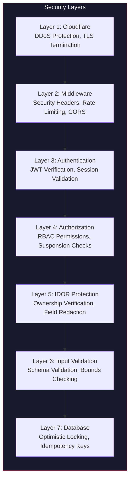

# Security Layers

Rate limiting, CORS, CSP, RBAC, IDOR protection, and authentication hardening.

---

## Overview

MaintainEX implements defense-in-depth security with multiple overlapping layers. Security is enforced at the middleware level, route handler level, and database level.

---

## Security Stack



---

## Layer 1: Cloudflare Edge

- TLS 1.3 termination
- DDoS protection (volumetric and application layer)
- Web Application Firewall (WAF)
- Bot management
- GeoIP-based blocking (configurable)

---

## Layer 2: Middleware Security Headers

Defined in `middleware.ts:12-30`:

### Standard Security Headers

| Header | Value | Purpose |
|---|---|---|
| `Strict-Transport-Security` | `max-age=31536000; includeSubDomains` | Force HTTPS for 1 year |
| `X-Frame-Options` | `SAMEORIGIN` | Prevent clickjacking |
| `X-Content-Type-Options` | `nosniff` | Prevent MIME sniffing |
| `X-XSS-Protection` | `1; mode=block` | XSS filter |
| `Referrer-Policy` | `strict-origin-when-cross-origin` | Control referrer info |
| `Permissions-Policy` | `camera=(), microphone=(), geolocation=()` | Disable unused APIs |
| `Cross-Origin-Opener-Policy` | `same-origin` | Isolate browsing context |
| `Cross-Origin-Resource-Policy` | `same-origin` | Prevent cross-origin reads |
| `X-DNS-Prefetch-Control` | `on` | Enable DNS prefetch |

### Coconut (Admin Panel) Headers

Additional headers for admin routes (`middleware.ts:24-30`):

| Header | Value |
|---|---|
| `X-Robots-Tag` | `noindex, nofollow` |
| `X-Frame-Options` | `DENY` |
| `Cache-Control` | `no-store, no-cache, must-revalidate, proxy-revalidate, max-age=0` |
| `Pragma` | `no-cache` |

---

## Rate Limiting

Defined in `middleware.ts:32-36`:

| Category | Max Requests | Window | Applies To |
|---|---|---|---|
| Default | 100 | 60 seconds | All routes |
| Auth | 5 | 60 seconds | `/auth/*` routes |
| Admin | 200 | 60 seconds | `/admin/*` routes |

### Per-Account Mobile Login Lockout

Beyond middleware rate limiting, mobile login has additional protections:

- **Per-phone lockout**: 5 failed OTP attempts per phone number
- **Per-IP aggregation**: Cross-IP tracking prevents distributed attacks
- **Credential stuffing detection**: 5+ unique email attempts from single IP triggers IP block
- **Bot detection**: Interval variance analysis on login patterns

---

## Layer 3: Authentication

### JWT Verification

All authenticated routes verify:

1. **Signature**: HMAC-SHA256 via Web Crypto API (`middleware.ts:65-80`)
2. **Expiry**: `exp` claim checked against current time
3. **Audience**: `aud` claim must match expected audience
4. **Issuer**: `iss` claim must be `maintainex`

### Token Revocation

- Staff JWT: Checked against `AdminSession.revokedAt` on every request
- Marketplace JWT: Session invalidation via `UserSession.isValid = false`
- Refresh token rotation prevents token reuse

### OTP Security

| Protection | Implementation |
|---|---|
| Rate limit | 3 OTPs/phone/hour, 5 OTPs/IP/hour |
| Cooldown | 60 seconds between sends |
| Attempt lock | 5 wrong attempts = lock, new code required |
| Code expiry | 5 minutes |
| Hashing | OTP code stored as hash, never plaintext |

---

## Layer 4: Authorization

### Admin RBAC

Six roles with granular permissions (`lib/admin-types.ts:12-100`):

```
SUPER_ADMIN: 36 permissions (full access)
MANAGER: 26 permissions (operational)
FINANCE: 14 permissions (financial)
USER_MANAGEMENT: 17 permissions (user operations)
SUPPORT: 12 permissions (customer support)
TECHNICAL: 5 permissions (system health)
```

Enforced via `getAdminSession()` which loads role and checks permission before route handler executes.

### Suspension Enforcement

`assertNotSuspended()` blocks write operations for:

- `isSuspended === true` — Returns 403
- `isBanned === true` — Returns 403
- Applied to 41+ write routes in `app/api/mobile/`

### Job-Level Authorization

Job transitions verify actor identity (`lib/domain/job-lifecycle.ts:14-34`):

- Customer can only accept quotes on their own jobs
- Provider can only request completion on jobs they were accepted for
- Company members must have active membership in the company

---

## Layer 5: IDOR Protection

### Job Detail Endpoint

`GET /api/mobile/v2/jobs/[id]` implements ownership verification:

1. Fetch job with ownership fields (customerId, acceptedQuote.providerId)
2. Verify requesting user is customer, provider, or company member
3. Redact sensitive fields for non-owners:
   - Internal admin notes
   - Fraud flags
   - Financial details

### Quote Submission

Quote operations verify:
- Provider is verified (`identityStatus === 'VERIFIED'`)
- Provider is not suspended/banned
- Quote belongs to the correct job

---

## Layer 6: Input Validation

### Pricing Bounds

`validatePriceAmount()` (`lib/pricing/fees.ts:30-36`):

- Rejects negative and zero prices
- Enforces minimum (`minJobAmountCents`) and maximum (`maxJobAmountCents`)
- Throws `PriceBoundsError` with bounds details

### Quote Validation

`validateQuotePrice()` (`lib/pricing/engine.ts:173-181`):

- Must be positive
- Must not exceed 3x customer budget

### Identifier Validation

`validatePricingIdentifiers()` (`lib/pricing/engine.ts:25-79`):

- Category must exist
- Service template must belong to category
- Job's category must match input

---

## Layer 7: Database Concurrency

### Optimistic Locking

Job state transitions use `updateMany` with status guard (`lib/domain/job-lifecycle.ts:85-89`):

```typescript
const changed = await prisma.marketplaceJob.updateMany({
  where: { id: ctx.jobId, status: job.status },  // Status guard
  data: { status: targetStatus },
})
if (changed.count !== 1) throw new Error('Job state changed concurrently')
```

If another request modified the status between read and write, `changed.count` will be 0 and the operation fails safely.

### Idempotency Keys

All ledger postings require unique idempotency keys (`lib/ledger.ts:75-77`). Prevents duplicate financial transactions.

---

## CORS Configuration

Not explicitly configured in middleware (Next.js defaults). API routes use standard CORS headers for mobile app origins.

---

## Secrets Management

| Secret | Environment Variable | Purpose |
|---|---|---|
| JWT Secret | `JWT_SECRET` / `NEXTAUTH_SECRET` | Legacy admin token signing |
| Marketplace JWT | `MARKETPLACE_JWT_SECRET` | Mobile app token signing |
| Staff JWT | `STAFF_JWT_SECRET` | Admin panel token signing |
| Database URL | `DATABASE_URL` | PostgreSQL connection |
| Expo API URL | `EXPO_PUBLIC_API_URL` | Mobile app base URL |

All secrets stored in environment variables, never in code.

---

## Security Monitoring

Admin security dashboard (`/admin/security`):

- Failed login attempts
- Credential stuffing detection (5+ unique emails/IP)
- Bot/cron pattern detection (interval variance)
- Suspicious login activities (`LoginActivity.isSuspicious`)

---

## References

- Middleware: `middleware.ts`
- Admin RBAC: `lib/admin-types.ts`
- Mobile auth: `lib/mobile-auth.ts`
- Admin RBAC helper: `lib/admin-rbac.ts`
- Login activity tracking: `LoginActivity` model in `prisma/schema.prisma`
- Authentication: [authentication.md](./authentication.md)
- Deployment: [deployment.md](./deployment.md)
