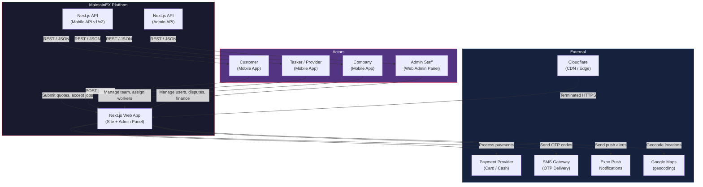
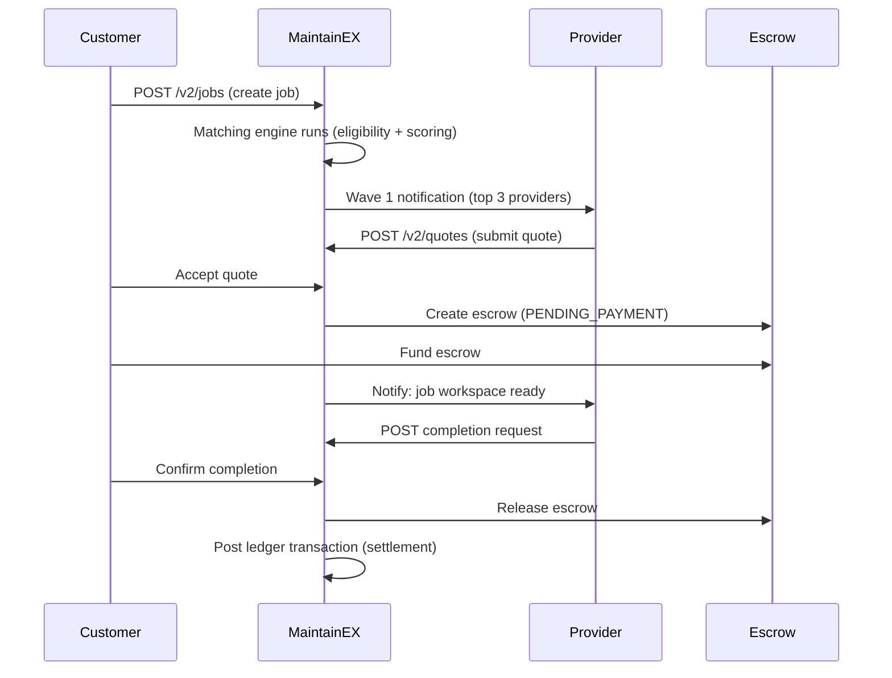
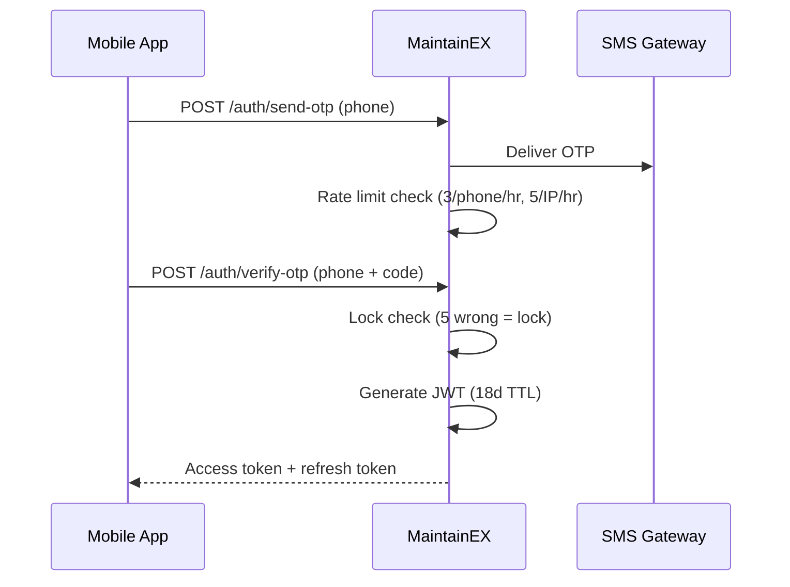

# System Context

C4 Level 1 — System Context diagram for MaintainEX.

---

## Actors

| Actor | Description | Auth Method |
|---|---|---|
| **Customer** | Posts jobs, reviews providers, makes payments | JWT (marketplace), OTP |
| **Tasker / Provider** | Individual service provider, submits quotes, completes jobs | JWT (marketplace), OTP |
| **Company** | Business entity with team members, manages multiple providers | JWT (marketplace), company membership |
| **Admin (Staff)** | Platform operations: KYC, disputes, finance, technical | JWT (staff), 2FA (TOTP) |
| **System (Cron)** | Background jobs: wave expiry, settlement, notifications | Internal / service mesh |

---

## Context Diagram

---

## System Boundaries

### Inside MaintainEX

- **Web Application** — Next.js 14 App Router serving the public website, customer portal, and admin panel. Routes are defined in `app/` with API handlers in `app/api/`.
- **Mobile API** — REST API consumed by the Expo mobile app. Two versions coexist: v1 (legacy) and v2 (current). Defined in `app/api/mobile/`.
- **Admin API** — Internal API for the admin panel. Protected by staff JWT with role-based access control. Defined in `app/api/admin/`.

### Outside MaintainEX

| Integration | Protocol | Purpose |
|---|---|---|
| Payment Provider | HTTPS | Card processing, cash-to-agent commission |
| SMS Gateway | HTTPS | OTP delivery for phone-based auth |
| Expo Push Service | HTTPS | Mobile push notifications |
| Google Maps API | HTTPS | Geocoding, distance calculations |
| Cloudflare | HTTPS/TLS | CDN termination, DDoS protection, security headers |

---

## Data Flows

### Job Lifecycle Flow

### Auth Flow

---

## Trust Boundaries

| Boundary | Mechanism |
|---|---|
| Client <-> Platform | TLS 1.3 (via Cloudflare), HSTS enforced |
| Platform <-> Database | Same Docker network, no external exposure |
| Platform <-> External APIs | Outbound HTTPS only, secrets in environment |
| Admin Panel | Staff JWT + RBAC (6 roles), session table with revocation |
| Mobile Auth | Marketplace JWT (18d) + refresh tokens, phone OTP |
| Financial Operations | Double-entry ledger, idempotency keys, commission config |

---

## References

- Container diagram: [container.md](./container.md)
- Authentication: [authentication.md](./authentication.md)
- Security: [security-layers.md](./security-layers.md)
